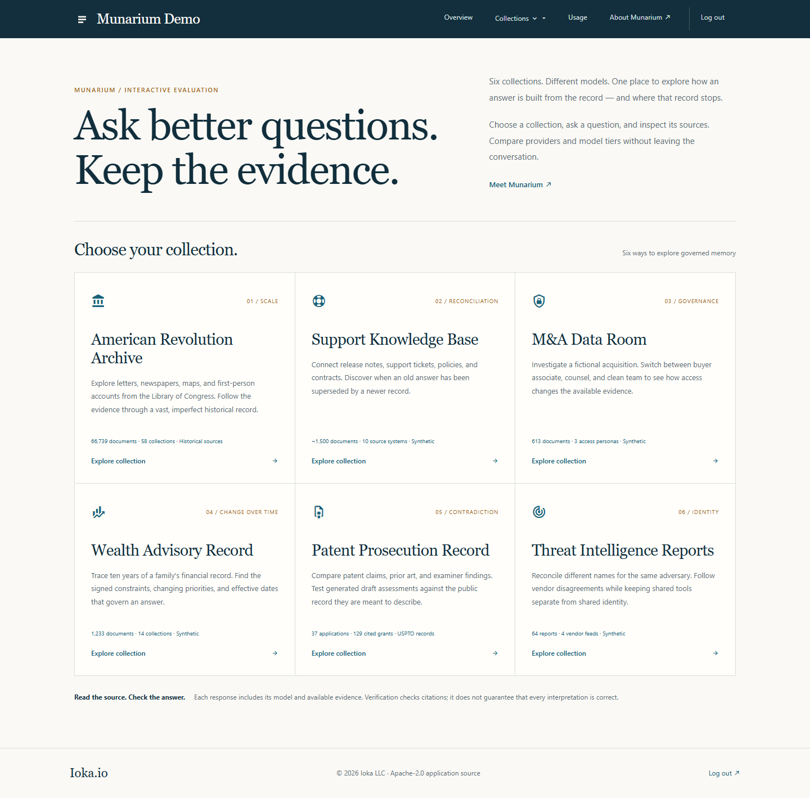

# Munarium Demo

Six working retrieval applications built with [Munarium](https://github.com/iokaio/munarium): an American Revolution archive, support knowledge base, acquisition data room, financial advisory workspace, patent collection, and threat intelligence library. Search sources, ask grounded questions, inspect citations, and compare the access granted to different personas.

The application is an ASP.NET Core 10 Razor Pages backend for the browser. It keeps Server credentials on the server and issues scoped capabilities for each corpus. The repository includes all six datasets, runbooks, shapes, provider definitions, and loading tools.

Use it to evaluate source retrieval, answer citations, model selection and
collection access before building your own application. The data-room personas
are selectable demonstration roles; they are not assigned to visitors by an
organization's identity system. Local model results should be evaluated against
your own questions and acceptance criteria.

The default deployment uses **Munarium Server 1.1.1**, PostgreSQL 16, **.NET 10**
and optional **Ollama 0.11.10**. The web app is built from this checkout; this
repository has no published GitHub release as of **2026-09-10**. See
[release compatibility](docs/releases/README.md) for the pinned Server digest
and recorded validation.



## Run locally

Install Docker with Compose and Python 3.11 or newer. On Windows, `py` can replace `python`. Run from the repository root:

```console
python -m pip install -r tools/requirements.txt
python tools/setup.py init
python tools/setup.py start --provider ollama
python tools/setup.py load --corpus support --provider ollama --approve
python tools/setup.py verify --corpus support
```

Open <http://localhost:5310/support> for the first workspace. Other workspaces
become searchable after their corpora are loaded. To load all six, run
`python tools/setup.py load --provider ollama --approve`, then
`python tools/setup.py verify`.

The full dataset has 70,415 documents; archive verification, extraction, and
indexing take longer than starting the containers. Ollama downloads approximately
1.5 GB of models. Allow additional disk for Docker images, database indexes, and
extracted documents. Setup verification checks active collections and document
counts; follow the [quickstart](docs/guides/quickstart.md) to test search and chat.

The default stack binds to loopback and bypasses the visitor gate in Development. Follow the [hosting guide](docs/ops/deployment.md) before exposing it externally. Cloud providers are optional and use your own credentials.

## Learn and contribute

- [Documentation index](docs/README.md), [quickstart](docs/guides/quickstart.md), and [configuration](docs/configuration.md)
- [Data and provenance](data/README.md), [data rights](data/RIGHTS.md), and [runbooks](docs/guides/runbooks.md)
- [Development](docs/guides/development.md), [contributing](CONTRIBUTING.md), [security reporting](SECURITY.md), and [support](SUPPORT.md)

Application code is licensed under [Apache 2.0](LICENSE). Preserve [NOTICE](NOTICE), [third-party notices](THIRD_PARTY_NOTICES.md), and the original rights in bundled data. [Trademarks](TRADEMARK.md) are separate from the software license.
