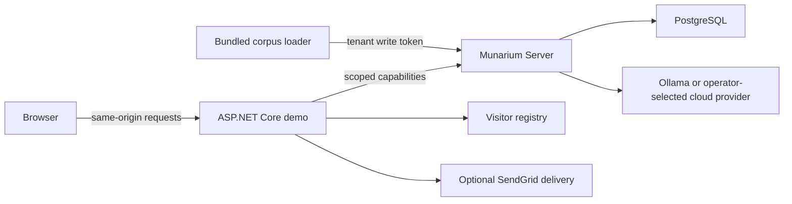

# Architecture

Razor pages render the six workspaces. JavaScript calls the demo's `/api/` endpoints; it does not receive the Server management token or cloud-provider credentials. `TokenCache` obtains corpus-scoped capabilities, and persona selection further restricts the data-room scope. The Server enforces collection permissions for retrieval and completion.

Raw documents and indexes live in PostgreSQL in the supplied Compose deployment. YAML runbooks define collection bindings, retrieval, query expansion, model policy, and index/cutover steps. The loader verifies bundled documents, uploads them, and drives only its own recorded indexing runs.

The application uses its own HTTP client in `src/Demo.Web/Services/MunariumClient.cs`;
it does not depend on a published Munarium SDK package. The root Compose stack
pins Server 1.2.1. Server 1.1.1 and later supply the model-routing behavior this
demo expects. Both search and chat use `/v1` runbook sessions; search submits
`complete:false`, while chat may stream a completing turn over REST.
Matrix is not part of the local Compose stack.

Server 1.2.1 is published and preserves that API. Its collection query,
publication governance and original-file authorization operations are separate
interfaces that this web adapter does not call. Installing the image does not
add those workflows or a vocabulary editor to the UI. Session retrieval on
Server 1.2 can apply collection vocabulary while retaining runbook model policy.
See [the 1.2.1 integration guide](releases/server-1.2.1.md).

The thirteen additional applications have separate Compose files and SDK builds:
they pin Server 1.2.1 and the official clients at
`705316332468c3c5eb50a96943f223f1bda1f09e`. The inventory example also builds
Matrix from that checkout. Their recorded qualification is independent of the
web stack and upstream Server release qualification.

The web app stores visitor emails, code hashes, blocking and allowance records in SQLite. Turn counters and some revocation state remain in memory. Operate a single web replica. Matrix is an optional integration, and is not needed for any bundled corpus.

`/livez` checks web-process liveness. `/readyz` also checks Server readiness and must not be used as a restart probe. Search and chat depend on active corpus indexes and an available model for completion; web readiness alone does not certify them.
