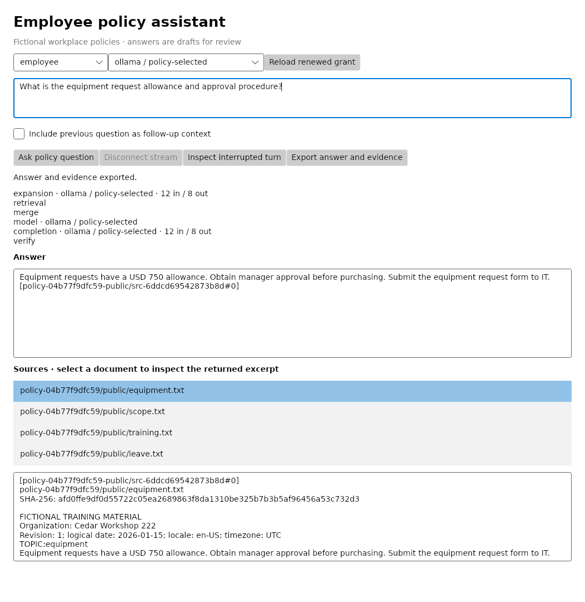

# Employee policy assistant

## Business case

A company with policies spread across employee handbooks, regional guidance and HR documents may receive the same equipment, training and leave questions repeatedly. Employees need answers that reflect their location and access rights, while HR needs a way to inspect the policy behind an answer. A similar desktop assistant could reduce routine policy searches and support requests by presenting scoped answers with source excerpts. The business value is easier self-service and more consistent policy interpretation, with HR retaining responsibility for exceptions and final decisions. This synthetic demo does not establish a measured reduction in support volume.

## Application



Rendered from the running Avalonia window during the controlled headless integration test, using generated fictional policies. The displayed `ollama / policy-selected` identifies the canned protocol fixture; no local model runs. Native window decorations vary by operating system.

This C#/.NET 10 desktop application uses the official Munarium client and Server 1.1.1 to answer workplace policy questions. Select an employee, regional, or HR tutorial identity; ask a question; inspect real Server phase progress; open a returned source excerpt; and export the answer with its evidence. Avalonia supplies the native desktop controls. The model cannot authorize purchases or disclose policies that Server withheld from the identity.

## Run the local tests

Install Git and Docker Desktop with Linux containers on Windows or macOS, or Docker Engine with Compose on Linux. The runner downloads the complete Munarium checkout pinned at `bb6e92a72a3944cff4d4bf0c1b470afcf3f4dfb3`; no second checkout or host .NET runtime is required for automated tests. Initial image and package provisioning needs Internet access. The controlled suite and generator then use local containers only.

From the repository root:

```powershell
./src/employee-policy-assistant/local.ps1 -Action test
```

```sh
sh src/employee-policy-assistant/local.sh test
```

The workflow builds the desktop and harness, runs unit checks, starts dedicated Server/PostgreSQL/provider-fixture containers, generates and hashes the documents and oracle, applies the runbook, ingests documents, verifies indexes, and approves only the intended test cutovers. It then runs business acceptance, failure/recovery and headless UI tests, followed by the .NET client unit and REST/gRPC conformance suites. Failed tests or unexpected skips return a nonzero exit status. Two upstream pure-kernel chronology cases are reported as skips rather than passes. Default services publish no host ports and belong to the `policy-wave1` Compose project.

Tests run serially because outage injection changes the dedicated provider fixture. Generated documents, private test oracles, capability grants, and reviewable outputs have separate mounts. Neither the desktop application nor the provider fixture reads the oracle file. Management credentials are available only to bootstrap and privileged integration checks; ordinary application operations use issued query capabilities.

## Launch the native desktop

Provision the desktop endpoint and tutorial grants, then publish a self-contained executable:

```powershell
./src/employee-policy-assistant/local.ps1 -Action desktop
./src/employee-policy-assistant/local.ps1 -Action publish -Runtime win-x64
$env:POLICY_CREDENTIALS = (Resolve-Path artifacts/employee-policy-assistant/desktop/credentials).Path
$env:MUNARIUM_REST_URL = 'http://127.0.0.1:18082'
./artifacts/employee-policy-assistant/desktop/win-x64/Policy.Desktop.exe
```

```sh
sh src/employee-policy-assistant/local.sh desktop
sh src/employee-policy-assistant/local.sh publish linux-x64
export POLICY_CREDENTIALS="$PWD/artifacts/employee-policy-assistant/desktop/credentials"
export MUNARIUM_REST_URL=http://127.0.0.1:18082
./artifacts/employee-policy-assistant/desktop/linux-x64/Policy.Desktop
```

Choose `osx-arm64` for Apple Silicon, `osx-x64` for Intel Macs, or `linux-arm64` for a native Linux ARM64 build. Publishing may download runtime assets. The desktop profile binds Server only to loopback port 18082; it leaves other projects untouched. The native Linux executable requires a graphical desktop and Avalonia's native platform dependencies. Self-contained publishing removes the host .NET prerequisite but does not establish native OS compatibility; record native launch, text input, source navigation, and file-picker/export checks separately for each OS.

The local issuer deliberately provisions four fictional identities for the tutorial's identity selector. Possession of an HR grant permits HR access; choosing a label is not authentication. In an enterprise deployment, replace the local grant files with the organization's authenticated token broker and provision only identities the signed-in user may assume. Grants expire after one hour, remain under ignored artifacts when exported for native use, and must not be shipped inside the executable. Close the old session when switching identities, clear its answer and source viewer, and begin a new session with the new uid and clearance.

The default desktop bootstrap uses controlled responses. For real desktop answers, run `local.ps1 -Action desktop -Provider openai` or `sh src/employee-policy-assistant/local.sh desktop openai` from the repository root; the full PowerShell path is `./src/employee-policy-assistant/local.ps1`. Substitute anthropic or openrouter to select another backend. The cloud desktop setup uses the same three-key environment profile as cloud tests and each provider's preferred model. Restart the desktop after changing its provider/configuration; the model selector shows the selection allowed by that issued grant. Asking real cloud questions consumes provider tokens.

## What to inspect

| Concern | Implementation | Developer lesson |
|---|---|---|
| Synthetic inputs and oracle | [Fixtures.cs](../../../src/employee-policy-assistant/Policy.Harness/Fixtures.cs) | Seven new documents, seed 222, fixed 2026-01-15 logical date, canonical UTF-8, hashes, independent expected outcomes |
| Bootstrap and scope | [Bootstrap.cs](../../../src/employee-policy-assistant/Policy.Harness/Bootstrap.cs), [policy.yaml](../../../src/employee-policy-assistant/runbooks/policy.yaml) | Four collections, explicit access levels/compartments, index approval, short-lived capabilities |
| Session and recovery | [PolicySession.cs](../../../src/employee-policy-assistant/Policy.Core/PolicySession.cs) | Official async REST client, durable intent, no blind paid retry, identity-preserving renewal |
| Desktop controls | [PolicyWindow.cs](../../../src/employee-policy-assistant/Policy.Desktop/PolicyWindow.cs), [PolicyViewModel.cs](../../../src/employee-policy-assistant/Policy.Desktop/PolicyViewModel.cs) | Native input, async view model, real stage progress, source inspection, local exports |
| Business assertions | [Acceptance.cs](../../../src/employee-policy-assistant/tests/Acceptance.cs) | Exact allowances, forbidden source/answer content, missing-evidence language, actual model routing |
| Failure checks and UI interaction | [IntegrationTests.cs](../../../src/employee-policy-assistant/tests/IntegrationTests.cs), [DesktopTests.cs](../../../src/employee-policy-assistant/tests/DesktopTests.cs) | Typed refusal, token expiry, stream disconnect, restart, input and rendering tests |

The corpus contains public equipment, training, leave and scope documents, West and East commute policies, and an HR-only retention review policy. Employee grants have level 0; regional grants have level 1 plus their region compartment; HR grants have level 2 plus the HR compartment. Server filters collections before retrieval and completion. A higher level alone does not grant a missing regional compartment. Synthetic canary values in the HR document make leakage assertions measurable without private data.

Ask an equipment question as an employee and inspect its USD 750 allowance and manager-approval source. Ask about the West commute allowance first as a West employee, then as the ordinary employee. Ask the confidential retention question as HR and employee. The employee answer must acknowledge unavailable evidence and must contain neither the confidential code nor amount. A moonbase question demonstrates absent evidence. Follow-up mode carries at most 600 characters of the previous user question; previous model answers never become authoritative policy evidence.

## Models and provider coverage

The keyless fixture serves the Ollama protocol with controlled responses derived from the request context. It tests application wiring and access boundaries. The explicit cloud action runs six fresh business cases across the three provider preferences in the shared root [`.env.local.sample`](../../../.env.local.sample):

| Provider | Preferred model variable and default | Assigned cases |
|---|---|---|
| OpenAI | `OPENAI_MODEL=gpt-5.4-mini` | Equipment allowance; training allowance |
| Anthropic | `ANTHROPIC_MODEL=claude-haiku-4-5-20251001` | West regional allowance; regional access denial |
| OpenRouter | `OPENROUTER_MODEL=qwen/qwen3.8-flash` | HR access denial; permitted HR answer |

Use existing root `.env.local` keys, or copy the sample only when that local file is absent and fill the three empty provider key placeholders. The cloud override passes keys only to Server and model preferences to bootstrap. It never places keys in the desktop, tests, screenshots, logs, or exports. Default controlled tests do not use cloud providers even when keys are present.

```powershell
./src/employee-policy-assistant/local.ps1 -Action cloud
```

```sh
sh src/employee-policy-assistant/local.sh cloud
```

Each provider receives its own runbook/configuration namespace and at least two assertions against the independent oracle. Each invocation creates a fresh run directory under `artifacts/employee-policy-assistant/cloud/<run-id>/<provider>/`. Every assigned case must pass. A provider failure still allows the remaining providers to run, with a failing overall exit status. Missing keys, unavailable models, missing outputs, wrong actual model identity, unexpected skips, and failed business assertions cannot become a successful qualification.

This runbook enables model query expansion, so each question can spend tokens on both expansion and completion. The selected session override must reach both stages; tests inspect the streaming metadata. A disallowed provider is refused before either stage calls it. Expansion starts with a 64-token budget and completion with 768; Server may perform its own retries. Reports preserve actual expansion usage and completion totals, including Server retries. Disjoint provider assignments measure coverage, not relative model quality.

Real AI acceptance uses only OpenAI, Anthropic, and OpenRouter. Run both test and cloud for complete application and AI qualification. The controlled fixture implements the Ollama wire protocol without running Ollama or loading any model; no local completion-model download, GPU, or inference container is required. Ollama support in the original web demo is unchanged.

## State, evidence, and recovery

The application records uid, session ID, exact query, and uncertain intent before dispatching a turn, then saves the completed response before export. Reusing a completed work identifier restores the saved result without another completion. Namespaces include fixture, shape, runbook, provider, and model revisions. Concurrent use of the same local state directory is outside this single-process desktop tutorial; use a separate work folder per running desktop instance.

A disconnected stream leaves the turn uncertain. Use **Inspect interrupted turn** to read the session transcript, including after restarting the application and reselecting the same identity. Only exactly one matching completed transcript turn resolves the uncertainty. Empty or ambiguous transcripts remain uncertain and block automatic resubmission. Token renewal reloads a new grant for the same uid and configuration without resending the question. Server 1.1.1 accepts a 30-second expiry skew allowance; the integration test waits past it before asserting rejection.

Exports contain the draft answer, served collection/chunk citation labels, actual source paths and hashes, excerpts, and a JSON evidence sidecar. The application rejects unserved citations and Server verification violations. Those checks do not prove every sentence is semantically faithful; a person still reviews the policy answer. Recovered responses preserve Server's nested completion routing metadata and are marked recovered; unavailable live-only fields are not invented in the sidecar. Token grants and AI-provider secrets never appear in exported answer files.

## Reports, rendering, and cleanup

Find generated answer text, evidence sidecars, per-case quality records, aggregated `quality.json`, native TRX reports, and converted JUnit XML beneath `artifacts/employee-policy-assistant/`. Failure journals remain for inspection. Controlled application runs also capture `application.png` from the actual window; copy a reviewed capture into this documentation folder after relevant UI changes. The screenshot test uses [Avalonia's headless XUnit platform](https://docs.avaloniaui.net/docs/testing/headless-xunit) with Skia rendering and synthetic inputs. Keep image captions clear about headless rendering and native OS qualification.

Regenerate the desktop PNG by running the documented `test` action, then copy `artifacts/employee-policy-assistant/test/<run-id>/application.png` to `docs/demos/employee-policy-assistant/application.png`, using the run ID printed by the wrapper. Bootstrap reports have unique Server run IDs in their filenames; SDK reports are retained beneath that test invocation's `sdk/` folder. Preserve failed runs when producing new screenshots or reports.

In a saved transcript, `completion.provider` identifies the provider family and `completion.model` identifies the actual model; `completion.resolved.provider` identifies the named provider configuration. Recovery verifies both the requested configuration and actual family/model, preserves the original stored completion, and reads `was_override` from `resolved`. This distinction is exercised by the lost-stream recovery test.

Use `local.ps1 -Action stop` or `local.sh stop` to stop only this project's services while retaining state. Compose `down` retains named volumes; adding `--volumes` deliberately discards this project's database, generated documents, oracle, and grants. Host artifacts remain. Never apply test outage or reset commands to an unrelated shared stack.

The source and synthetic templates use Apache-2.0. NuGet lock files preserve runtime/test dependency resolutions. Avalonia is pinned at 11.3.12; the desktop directly pins `Tmds.DBus.Protocol` 0.21.3 for its [upstream security fix](https://github.com/advisories/GHSA-xrw6-gwf8-vvr9). Server, PostgreSQL, and the .NET base image use digests. No Server or Matrix source changes are required.

## Recorded validation

On 2026-09-10, Docker Desktop on Windows with Linux/AMD64 containers passed all 24 application tests (seven unit, seven Server integration, eight controlled business cases, and two headless UI tests), plus 82 .NET SDK tests with two documented upstream chronology skips. Six fresh real-AI business cases passed, two each on OpenAI, Anthropic, and OpenRouter using the preferred models above. The controlled run regenerated the application PNG. A self-contained Windows x64 executable was published; interactive native launch and file-picker checks, native Linux/macOS hosts, and ARM64 qualification remain pending.

The built runner image occupies approximately 2.23 GB. The measured Windows Docker engine exposed 12 CPUs and 31.3 GiB RAM; these are the test environment, not minimum requirements. Idle Server, PostgreSQL, and controlled fixture together used about 91 MiB. The application integration/acceptance/UI run took about 39 seconds, including the token-expiry wait. Package and image downloads depend on cache state; real-provider latency varies. No local completion model is provisioned.


Shared [capacity checks, workload measurement, image download sizes and native-host checklist](../../demo-qualification.md) apply to this demo. Reports describe the selected profile and retain failed outcomes.

## Fixture profiles and native Windows qualification

The [profile definitions](../../../src/employee-policy-assistant/fixture-profiles.json) select independently seeded business facts. `default` uses seed 222 and seven documents; `heldout` uses seed 8222 and seven documents with different allowances, retention values and a private canary. `stress` uses seed 9222, changed policy facts and 63 additional unrelated documents, for 70 indexed documents. All profiles retain eight independently authored access and answer scenarios. Manifests record the profile, template revision, seed, document counts, logical clock and content hashes. Three native tests compare both corpus and private oracle bytes across separate .NET processes.

Run `./tools/measure_demo.ps1 -Demo employee-policy-assistant -Project policy-heldout -Profile heldout`, or `sh tools/measure_demo.sh employee-policy-assistant policy-stress stress`. Use a new project for each profile. Online qualification and online desktop setup require the default corpus. The six cloud cases retain two per provider, with a 60-second pause before each new OpenRouter case.

On 2026-09-11, each profile passed 27 application tests and 82 SDK tests, with the same two upstream chronology skips:

| Profile and host | Measurement ID | Elapsed | Sampled project peak memory |
|---|---|---:|---:|
| Held-out, Windows PowerShell | `df545524365743dda7c1c7a06915e950` | 108.04 s | 224,877,607 bytes |
| Stress, POSIX wrapper | `20260911T074124Z-7cd5e65b52101d68` | 106 s | 250,200,717 bytes |
| Default, fresh checkout through Ubuntu WSL | `20260911T074431Z-7906451e66128b41` | 106 s | 252,748,757 bytes |

The fresh checkout used snapshot `48360b47613f1f790dfafffa0ea7ca48d25f7a9c`, empty project state and the final source files; its test ID is `2859219b-68f7-4ddd-ad19-1dac3e59b4f7`. Cloud run `3a80be10665e4fc3aa7beb0c805a8006` passed all six cases on the three online providers. Reports remain beneath `artifacts/employee-policy-assistant/`. Sampled container memory excludes Docker VM and build overhead. WSL shares Docker Desktop and does not establish native Linux Engine compatibility.

A self-contained Windows x64 build from that snapshot also passed a native UI Automation check against the held-out backend: launch, question entry, the expected USD 925 answer, source selection with excerpt and SHA-256, export through the Windows Save dialog with a JSON evidence sidecar, and clearing answer/source state on identity change. The report and exports are under `native-validation/` in that artifact directory. The normal desktop port was occupied, so this check used a separate override with an automatically allocated loopback port. This supersedes the earlier pending Windows launch/export status; it is not a complete usability review. Native Linux/macOS desktop and ARM64 host checks remain unqualified.
