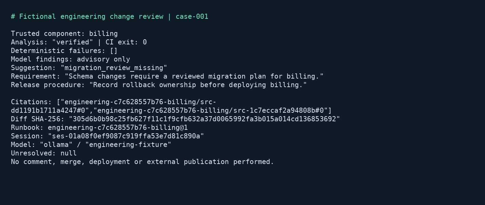

# Engineering change review

## Business case

A software company may want reviewers to see relevant design decisions and release procedures beside a proposed change. Engineers otherwise need to find those requirements manually, and a missing owner or migration discussion can be noticed late. A similar CI executable could attach cited advisory findings while enforcing a small set of deterministic submission rules. Engineers retain responsibility for technical correctness, security review and release approval. The fictional changes demonstrate workflow integration; they do not establish defect reduction or the reliability of an autonomous code reviewer.

## Application

This Rust CI executable reads a supplied diff and change manifest, selects a component's allowed runbook from trusted configuration, and exports Markdown and JSON review artifacts. It checks required owner and release-ticket fields in Rust. Model findings about the documented migration requirement remain advisory. Missing or unverified analysis has a distinct exit status.



The image is a Pillow rendering of actual CLI output, not an operating-system screenshot. Source, fixtures and native tests are in [src/engineering-change-review](../../../src/engineering-change-review).

## Run and inspect

Prerequisites are Git and local Docker with Compose and Linux containers. The runner pins Rust 1.98 and fetches the complete official client checkout at `bb6e92a72a3944cff4d4bf0c1b470afcf3f4dfb3`. The application uses the official Rust client by path dependency and commits its Cargo lockfile. Server 1.1.1 and PostgreSQL/pgvector are pinned by image digest.

| Action | PowerShell from repository root | POSIX from repository root |
|---|---|---|
| Complete keyless qualification | `./src/engineering-change-review/local.ps1 -Action test` | `sh src/engineering-change-review/local.sh test` |
| Online qualification | `./src/engineering-change-review/local.ps1 -Action cloud -Project engineering-cloud` | `sh src/engineering-change-review/local.sh cloud engineering-cloud` |
| Stop and retain state | `./src/engineering-change-review/local.ps1 -Action stop` | `sh src/engineering-change-review/local.sh stop` |

The default project is `engineering-wave3`. Select another `engineering-` project for empty volumes and use one wrapper invocation per project at a time. Wrappers inventory containers, require a local Linux engine, verify the served version, generate inputs, save index runs and approve only intended verified cutovers. No host ports are published. The generator has no network. After dependency provisioning, controlled tests run with cached dependencies and local containers.

From `src/engineering-change-review/`, after qualification:

```sh
docker compose --env-file ../../.env.local.sample -p engineering-wave3 run --rm --no-deps app review /work/manual/billing /inputs/changes/case-001 billing
docker compose --env-file ../../.env.local.sample -p engineering-wave3 run --rm --no-deps app review /work/manual/catalog /inputs/changes/case-001 catalog
docker compose --env-file ../../.env.local.sample -p engineering-wave3 run --rm --no-deps app review /work/manual/injected /inputs/changes/case-006 catalog
docker compose --env-file ../../.env.local.sample -p engineering-wave3 run --rm --no-deps app review /work/manual/missing-owner /inputs/changes/case-007 billing
```

The first two commands review the same diff under different permitted component requirements. Each uses a new work directory. The third diff contains an irrelevant instruction to select a privileged runbook; its selected scope remains catalog. The last command intentionally exits 1 because the owner is missing.

Read `review.md`, `review.json`, `journal.json` and `progress.json` beneath the corresponding `artifacts/engineering-change-review/` path. The review records the diff and manifest hashes, selected runbook, session, provider/model, returned source hashes and remaining verification problems. `journal.json` contains the supplied change text needed to identify the exact turn, so treat a real deployment's report bundle as source-code material. It contains no provider credentials in this demo.

| Exit | Meaning |
|---|---|
| 0 | Analysis verified and deterministic checks passed; model suggestions may still be present |
| 1 | Verified analysis exists, but a deterministic required field is missing |
| 3 | Analysis unavailable/unverified, invalid input/scope, or unresolved operation |

Unavailable analysis takes precedence when both kinds of issue occur; deterministic failures remain visible in JSON. The demo does not merge, deploy, approve a release or publish comments. A company can add a publication adapter after defining its own approval and credential boundary.

## Trusted scope and untrusted input

Bootstrap owns provider configuration, shapes, runbooks, ingestion and index activation. It issues a query-only CI capability for billing and catalog runbooks. The application maps its explicit component argument through that trusted configuration. A component name in the supplied manifest is reported as input data; it does not choose a runbook. The caller that runs CI must control the component argument and provision the appropriate scope map.

The fixture includes a separately indexed privileged procedure at clearance 2. Its runbook is absent from the CI map and capability. Tests attempt both an unsupported component selection and direct access to that privileged runbook, and inspect artifacts for its sentinel text. A wrong uid and an expired capability are also denied. The application cannot administer runbooks with its query credential. Tutorial static tokens must be replaced by organizational identity issuance in a deployment.

Diffs are bounded to 64 KiB of UTF-8 text and manifests to 8 KiB. The manifest schema rejects unknown fields. Diffs are supplied as text data to the bounded review prompt and are never executed. The application validates the returned schema, advisory flag, selected requirement code, exact requirement/release quotes, both citations and source hashes. This teaches a narrow schema-change review contract, not arbitrary code execution or general vulnerability analysis.

Every case changes a fictional schema. Odd-numbered cases omit the reviewed migration plan and produce an advisory finding; even-numbered cases declare one. Cases 007 and 008 additionally omit the owner and release ticket respectively. Case 006 includes the prompt-injection instruction. The independent oracle remains in a separate volume mounted only into tests; bootstrap, the application, Server and the canned provider cannot read it.

## Recovery and provider use

The app saves its input/configuration identity before session creation and its session ID before a paid turn. It saves real streamed progress and the completed result. A duplicate invocation reuses the saved result and returns the same CLI status. Changed input, identity or component requires a fresh work directory.

An interrupted stream, lost response or process crash leaves uncertain state. A normal rerun produces an unavailable report without resubmitting. Use `app recover WORK CHANGE_DIR COMPONENT` to read the original session. Recovery requires the matching uid/runbook and exactly one matching completed turn. It preserves available evidence and omits live fields absent from the transcript, including skipped-layer details. Empty transcripts remain unresolved. Session creation with an unknown outcome requires operator inspection. File leases prevent concurrent workers from submitting the same work item.

Only OpenAI, Anthropic and OpenRouter perform real completion. Reuse root `.env.local`, copying the sample only when that ignored private file is absent. Keys go only to Server, resolved through `credentialRef`; the app and fixture have no provider keys. The controlled provider serves canned Ollama-wire responses without any model runtime. No Ollama inference service, model download or GPU is required.

Online assignments are OpenAI 001/003/005, Anthropic 002/004/006, OpenRouter 007/008. Each independent OpenRouter case waits 60 seconds before submission. Every cloud invocation uses fresh work IDs; all assigned cases must satisfy the oracle and actual CLI exit checks. Expected deterministic failures are successful test outcomes, not successful changes. Completion starts with a 3072-token budget; Server may retry truncation once at a larger budget, and returned totals include that work. No model query expansion is configured. Usage snapshots and native reports are retained; this split establishes provider coverage, not a model ranking.

## Validation

On 2026-09-11, PowerShell run `251c16890ea243abac2df96efbfe96a4` passed all 25 application checks (six unit, eighteen controlled business/failure checks and one restart recovery) and 79 official Rust client checks. Formatting and strict Clippy passed. Fresh snapshot `ede71a350ca716c286af903dd5573b818e980d45` repeated the complete suite through the POSIX wrapper in empty `engineering-cleanroom` volumes, run `20260911T060414Z-1d054f3e6d071194`. Both generated manifest files have SHA-256 `E12800D7BA2F63B61E25DA948EE8C0F5D5C5F96E17FAEF5866B8CF3FDE595D97`. Reports are retained under `artifacts/engineering-change-review/test/`.

Online run `bfd0e28ce2e3428a938af381f91cb658` passed all eight assigned cases. OpenAI `gpt-5.4-mini` returned 1188 input / 315 output tokens across three cases; Anthropic `claude-haiku-4-5-20251001` returned 1373 / 429 across three; OpenRouter `qwen/qwen3.8-flash` returned 847 / 2258 across two paced cases. These are completion totals reported by Server, not billing estimates. Per-provider quality reports, packets, journals and usage snapshots remain under `artifacts/engineering-change-review/cloud/`. No failed qualification runs or unexpected skips occurred. Documentation, license, public-material and wrapper syntax checks passed.

Qualification used Docker Desktop on Windows with Linux/AMD64 containers, on a host exposing 12 CPUs and 31.3 GiB RAM. The cached fresh-checkout build and full controlled run took approximately two minutes; the online run took approximately four minutes including pacing. These elapsed times do not estimate a cold dependency download. The fresh runner image ID was `sha256:d2286d2c0e7da2df150d21ca40c37f06d7c0d8fe4927d5cf3f25e34f8a7de7df`. The captured image above comes from the controlled executable's actual Markdown export.

The generator fixes seed 11091, template revision 1, UTC logical time 2026-09-11, invariant formatting, eight change records and four procedure documents. It emits UTF-8/LF files with canonical hashes. Two independent generator processes must produce matching manifests, input bytes and private oracles. Native `cargo fmt`, strict Clippy and unit tests precede real-Server business, CLI, scope, expiry, outage, injection and recovery checks. The official Rust SDK unit/doc and REST/gRPC conformance suites run separately. Their chronology scenario is not implemented; no skipped test is counted as a pass.

`stop` retains all evidence and state. Run `docker compose --env-file ../../.env.local.sample -p engineering-wave3 down` from the source folder to remove only this project's containers/network while retaining volumes. Adding `-v` explicitly destroys its named input/credential/database volumes; host report bundles remain. Native Linux/macOS hosts and ARM64 require separate qualification; Windows Docker Desktop results do not establish them.


Shared [capacity checks, workload measurement, image download sizes and native-host checklist](../../demo-qualification.md) apply to this demo. Reports describe the selected profile and retain failed outcomes.
