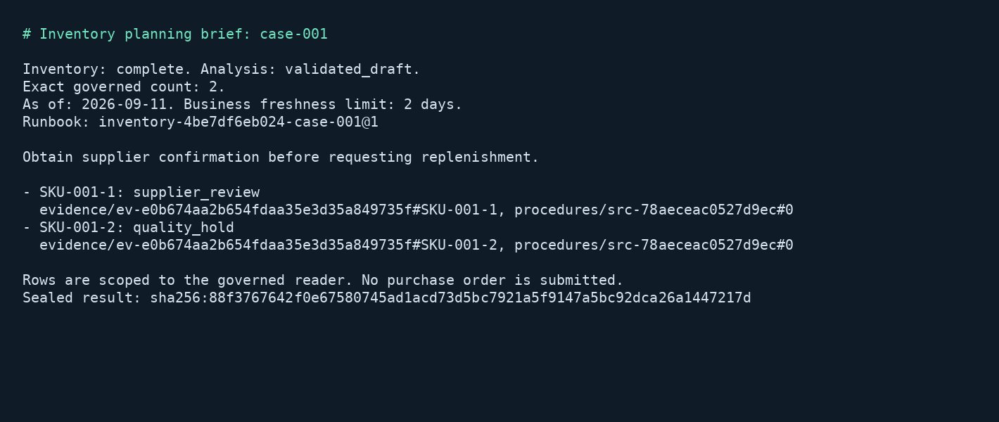

# Inventory replenishment briefing

## Business case

A distributor or manufacturer may want planners to review low stock alongside supplier and quality procedures. Searching documents cannot establish which inventory items are below their reorder levels, and a fluent answer based on an incomplete register can lead to the wrong purchasing decision. A similar solution could combine an authorized database result with cited procedural advice and make incomplete or stale evidence visible before a planner acts. People retain responsibility for supplier commitments, quality release and purchase approval. The fictional fixtures demonstrate those boundaries; they do not establish reduced shortages or financial savings.

## Application

This Python CLI uses the official Matrix client to register and verify a governed inventory query, then the official Server client to run a research profile combining that query with replenishment procedures. Matrix executes the declared SQL through a read-only PostgreSQL role subject to row-level security and seals its result into Server. The app reads the resulting manifest and bounded row pages, exports CSV and creates a cited Markdown brief. It submits no purchase orders.



The PNG is rendered from the executable's actual Markdown output. It is not an operating-system screenshot. Implementation and tests are in [src/inventory-replenishment](../../../src/inventory-replenishment).

## Run and inspect

Prerequisites are Git and Docker with Compose and local Linux containers. The Python runner pins Python 3.12, locks its dependencies and fetches the complete official checkout at `bb6e92a72a3944cff4d4bf0c1b470afcf3f4dfb3`. Both clients are installed from that checkout. Server 1.1.1 and PostgreSQL/pgvector are pinned by digest. The wrapper builds Matrix from the unchanged official Dockerfile at the same source revision and records its image identity; no second host checkout is needed. Matrix must report exact compatibility with the running Server.

| Action | PowerShell from repository root | POSIX from repository root |
|---|---|---|
| Complete controlled qualification | `./src/inventory-replenishment/local.ps1 -Action test` | `sh src/inventory-replenishment/local.sh test` |
| Online qualification | `./src/inventory-replenishment/local.ps1 -Action cloud -Project inventory-cloud` | `sh src/inventory-replenishment/local.sh cloud inventory-cloud` |
| Stop and retain state | `./src/inventory-replenishment/local.ps1 -Action stop` | `sh src/inventory-replenishment/local.sh stop` |

The default project is `inventory-wave3`. Use another `inventory-` project name for fresh volumes, and run one wrapper invocation per project at a time. The stack includes real Server and Matrix containers, separate Server and Matrix metadata databases, and a third database containing only the synthetic inventory. No host ports are published. Wrappers inventory existing containers before provisioning and operate only on the selected project.

After qualification, run these commands from `src/inventory-replenishment/`:

```sh
docker compose --env-file ../../.env.local.sample -p inventory-wave3 run --rm --no-deps app process --case case-001 --work /work/manual/complete
docker compose --env-file ../../.env.local.sample -p inventory-wave3 run --rm --no-deps app process --case case-001 --variant limited --work /work/manual/limited
docker compose --env-file ../../.env.local.sample -p inventory-wave3 run --rm --no-deps app process --case case-001 --variant stale --work /work/manual/stale
```

CLI exit 0 means complete inventory with validated advice; exit 2 means incomplete/unverified output. Each folder contains `inventory.md`, `inventory.csv`, `inventory.json` and `journal.json`. Compare `inventory.status`, `exact_count`, the manifest's `completeness.truncated`, its logical and artifact hashes, and each `evidence/<id>#<sku>` citation. CSV rows carry their coverage status even when the brief withholds advice. `--variant limited` uses a separately verified contract capped at one row. `--variant stale` asks as of September 20 for observations recorded September 11, exceeding the two-day business freshness limit.

To inspect an actual source outage, stop only the selected project's `inventory-db`, invoke `process` in another new work directory, inspect its unavailable count and retained procedure hits, then start that database again. The automated wrapper performs this sequence with cleanup even when its assertion fails. For a manually interrupted paid turn, replace `process` with `recover` using the same case, variant and work directory; do not create a new session to hide an uncertain result.

## Evidence and authority

The trusted runbook binds a declared contract and typed warehouse/date parameters. The model receives its result and supporting procedures; it never writes SQL or changes a warehouse binding. The source reader is neither owner nor superuser, has no RLS bypass, and defaults to read-only transactions. Matrix declares level-0 and level-2 classes using that same restricted source reader, allowing the test to prove artifact clearance independently of source row filtering. A planted restricted stock row is invisible to its RLS policy. Generator SQL and private oracle outputs have separate volumes unavailable to the application, Server or model fixture.

An exact count requires a matching sealed hash of the bound warehouse/date parameters, one identified Matrix table, the expected source and contract, the declared keyed schema, complete bounded paging, nontruncated manifest coverage and sufficiently recent observations. Live hierarchy metadata must also permit completeness. Counts describe the governed reader's result, not every row an administrator could see. A fresh SQL execution does not by itself mean the business observations are fresh: this app separately checks each sealed `observed_on` value against the explicit business date. This is an application freshness rule, not a claim that Matrix's execution timestamp measures stock age.

Document hits provide procedural guidance only. Their presence during a database outage cannot supply missing inventory rows. An unavailable, truncated, stale or unresolved structured result has no exact count and suppresses actionable Markdown advice. The model's raw response remains available for inspection. The application validates its JSON shape, copied constraint codes, complete row/action correspondence, row citations, procedure citations and source hashes. Suggestions require human review even when validation passes.

Bootstrap holds the operator credentials for Matrix assets, Server providers, ingestion and cutovers. The planner receives a capability with `query` and `evidence` scopes and an allowlist of runbooks. The `evidence` scope is required for manifest and row reads; Server 1.1.1 also permits sealing through that scope, so it is not a read-only evidence grant. The application uses only the official client's read surface. A deployment needing a strict read-only evidence principal must enforce that additional boundary at its API gateway. Evidence reads enforce tenant and manifest clearance rather than the session runbook allowlist. Tests obtain a separate elevated capability to produce restricted-class evidence, then prove the normal planner cannot read it. The retention test uses an operator-only REST purge of its own disposable artifact; subsequent SDK reads must report an unresolved citation with HTTP 410. The pinned Python SDK maps evidence-specific 403/410 responses to `UnexpectedError` with a status; tests assert that status without pretending these are its generic forbidden/not-found types. Server deduplicates artifacts by logical result, policy version and authorization class, even across different contracts. The stale and retention fixtures therefore use distinct per-run row keys as well as separate contracts, preventing their tests from purging shared business evidence. The application rejects a returned manifest whose recorded contract or parameter hash does not match its requested binding. The client application never seals evidence itself.

## Recovery and providers

The application journals its selection before session creation, saves the session ID before dispatch and checkpoints the completed response before exporting files. A repeated completed invocation restores exports and rechecks evidence availability without another completion. An uncertain turn requires explicit `recover` with the same arguments and work directory. Recovery reads exactly one matching completed transcript and resolves the sealed IDs cited by that answer. Missing or ambiguous transcripts remain uncertain. Live hierarchy and skipped-layer details absent from the transcript are omitted, and recovered packets are marked. File leases prevent simultaneous workers from dispatching the same work item.

Real AI runs use only OpenAI, Anthropic and OpenRouter. Reuse the ignored root `.env.local`; copy `.env.local.sample` only when no local file exists. Keys are passed only to Server and resolved through provider `credentialRef`. The application, generator and controlled provider do not receive them. The keyless provider supplies canned Ollama-wire responses without running inference or downloading a model.

The eight online cases assign 001/003/005 to OpenAI, 002/004/006 to Anthropic and 007/008 to OpenRouter. Each independent OpenRouter case waits 60 seconds before submission. New cloud run IDs prevent old completions from satisfying a new qualification. Initial completion budgets are 3072 tokens; Server may retry truncation once at a larger budget. Returned token counts include that work. No query-expansion task is configured. Provider usage snapshots and per-case quality reports are retained, and a failed provider does not prevent attempting the remaining providers.

## Validation

On 2026-09-11, PowerShell controlled run `b84fe40888724d87be9100d997d5d9f2` passed all 28 application checks: four unit checks, twenty-one controlled business/failure cases, one real database-outage case and two dependency-restart checks. The official Server Python suite passed 175 checks with four documented chronology skips. The official Matrix Python suite passed all 20 checks, including its enabled live service test, with no skips. Fixture manifest SHA-256 was `66581ED705737F85D5A8BAED84C3BB0F5F24F3655A46BCDEC605470B48E7AE56`.

The Matrix image built from the pinned source is `sha256:017820089ea9cbdccbd1d3ede0de519e4da9b054ae261e2f62eb7fdb997de675`, 28,185,690 bytes. Its initial cached-dependency compilation took approximately six minutes. The Python runner in that run was `sha256:baa4d572ce67c95b6184de7d354c16fbcb0918f429236c2c3cb65bbb42670dce`, 380,962,857 bytes. The complete cached controlled run took approximately two minutes on Docker Desktop for Windows, with Linux/AMD64 containers, 12 host CPUs and 31.3 GiB RAM. These are elapsed observations, not cold-download or production sizing measurements.

Earlier failures remain under `artifacts/inventory-replenishment/test/`: `e1bd2099c1d94713ba87959438c49222` encountered a Windows Compose remote-build path error; `612506f2d53d4a939e7ffc26380d8231` found the peer startup race; `711dadcc114c418990bbab144fe83754` found parameter occurrence order differing from Matrix's sorted binder; `439e3068172d426fbed8511fc9661790` correctly refused rewriting an immutable contract version; `55853e11f5094ca8a7aea2daa620f352` found missing evidence scope; `615d556465de4a7ca0fbf9e328c605d5` found a stale documentation example for the SDK paging keyword and evidence error-type assumptions; `2fbb60ab1a2e481bb19806cdeff68d1e` found shared logical artifacts across different contracts. Fixes use the direct pinned Docker build, explicit peer readiness, version-2 assets, the SDK's actual `from_` argument, status-aware evidence errors and distinct disposable scenario row keys. No Server, Matrix or SDK source was modified.

Fresh snapshot `36aae50405370ec923fabcc49eaf367b8784bfb9` passed the same 28 application, 175 Server client and 20 Matrix client checks through the POSIX wrapper in empty `inventory-cleanroom` volumes, run `20260911T063916Z-dada8ea8abc715a7`. Four documented Server chronology skips remained explicit. Its fixture manifest hash matched the PowerShell run. Documentation links, licensing, public-material checks and both wrapper syntax checks passed. Final online run `c75d867bbc3a4c79bdeb4c47d9c1ad4a` passed all eight cases: OpenAI `gpt-5.4-mini` returned 1380 input / 456 output tokens across three cases, Anthropic `claude-haiku-4-5-20251001` returned 1582 / 685 across three, and OpenRouter `qwen/qwen3.8-flash` returned 1131 / 3227 across two paced cases. These are returned completion counts, not billing estimates. Earlier online run `82ea90d5856b42108c2cdb6df3e59848` passed only OpenRouter case-007; all seven remaining answers used numeric row positions instead of SKU citation keys and were rejected. The final prompt explicitly explains the keyed citation format. Both runs and their actual responses remain under `artifacts/inventory-replenishment/cloud/`.

The generator fixes seed 13091, revision 1, UTC logical time September 11, 2026, and invariant UTF-8/LF output. Eight warehouses contain five visible stock rows each, plus one planted restricted row in the source database. Independent generator processes must reproduce input files, seed SQL and the private expected rows/counts. Native Python lint, formatting and unit checks precede real-Server/Matrix acceptance, wrong verified-question expectations, RLS/clearance, actual database outage, stale/truncated results, artifact expiry, provider outage, lost-stream recovery and process/dependency restart checks. Official Server and Matrix client suites run separately; documented Server chronology skips are reported as skips, never passes.

The official Matrix Dockerfile targets Linux/AMD64. Native Linux/macOS hosts and ARM64 remain unqualified. The optional Java port is a separate extension. Use `stop` to retain containers, or `docker compose --env-file ../../.env.local.sample -p inventory-wave3 down` from the source folder to remove only this project's containers/network while retaining volumes. Adding `-v` explicitly destroys its named databases, credentials and generated volumes; host reports remain.


Shared [capacity checks, workload measurement, image download sizes and native-host checklist](../../demo-qualification.md) apply to this demo. Reports describe the selected profile and retain failed outcomes.

## Held-out and stress profiles

The [profile definitions](../../../src/inventory-replenishment/fixture-profiles.json) select `default` (seed 13091, 41 database rows), `heldout` (seed 93091, 41 rows with independently generated stock levels), or `stress` (seed 103091, 401 rows: 50 per warehouse plus the restricted sentinel). Stress returns 17–18 governed rows in each of seven warehouses, exercising the application's two-row evidence pages; the first warehouse retains two selected rows for the explicit contract-verification question. All eight warehouses are independently checked against private exact rows/counts and grounded row citations. Selected rows are sorted by SKU to match the declared SQL ordering.

Manifests record profile, seed, generator/template revisions, warehouse/row/document counts, logical date, timezone, locale, procedure hashes and the SQL seed hash. Two separate network-disabled Python processes reproduce every public input, private oracle and SQL byte for each profile. Generation refuses a different profile in existing state. Raw stock rows and the private oracle remain outside the application mount. Online runs require the default profile.

Run `./tools/measure_demo.ps1 -Demo inventory-replenishment -Project inventory-heldout -Profile heldout`, or `sh tools/measure_demo.sh inventory-replenishment inventory-stress stress`, with new project state.

All profiles passed on 2026-09-11:

| Profile and entry point | Measurement ID | Application checks | Elapsed | Sampled peak CPU | Sampled peak memory |
|---|---|---:|---:|---:|---:|
| Held-out, PowerShell | `aaee95564e114a52ab8248f1cd42e9e6` | 30 | 108.84 s | 117.70% | 292,508,659 bytes |
| Stress, POSIX | `20260911T094927Z-77ede71f8d622248` | 30 | 108 s | 115.24% | 298,962,644 bytes |
| Default, fresh checkout through Ubuntu WSL | `20260911T095023Z-132aa9c88610bb6d` | 30 | 151 s | 107.68% | 286,707,937 bytes |

Every profile also passed Ruff formatting/lint, 175 Server SDK checks with the four documented chronology skips, and 20 Matrix SDK checks including the live service test. Stress independently verified all 126 selected rows across eight warehouses. Final source matches fresh-checkout snapshot `3323de2ab9c8e59b2ca801aa78702f0f0559d16a`, tested with empty project state. Test IDs are `74f76d093bc94352abf07927a5654359` (held-out), `20260911T094928Z-1eead84b11df0993` (stress), and `20260911T095026Z-74cff75da810d9ac` (fresh default). Online run `824f35179e0a4e67a8d5a35afc491881` passed eight fresh cases: three OpenAI, three Anthropic and two OpenRouter, with 60 seconds before each OpenRouter case. No local model inference ran.

Initial WSL measurement `20260911T094918Z-8e459c0adbade82a` stopped before testing because Docker's existing credential helper failed while resolving the public Dockerfile frontend. Its failed report is retained. The successful retry set `DOCKER_CONFIG` to a separate temporary directory containing an empty `config.json` (`{}`), allowing anonymous public-image resolution without changing the user's Docker configuration. The checkout contained no private environment file.

Held-out retained volumes occupy 151,641,929 logical bytes; stress occupies 151,923,882 bytes. The development runner is 380,965,901 bytes unpacked and the pinned Matrix runtime is 28,185,690 bytes unpacked. Reports remain under `artifacts/inventory-replenishment/`. Measurements used isolated projects on a shared Docker Desktop host with other qualification work active. Timings include cache/build effects; 100% CPU denotes one core. Sampled memory excludes host/VM/build-daemon overhead and may miss brief peaks. See the shared guide for compressed base-image transfers. WSL qualifies Linux userspace with Docker Desktop; native Linux/macOS, ARM64 and Apple Silicon emulation remain unqualified. Matrix's upstream pinned build still selects AMD64 explicitly.
