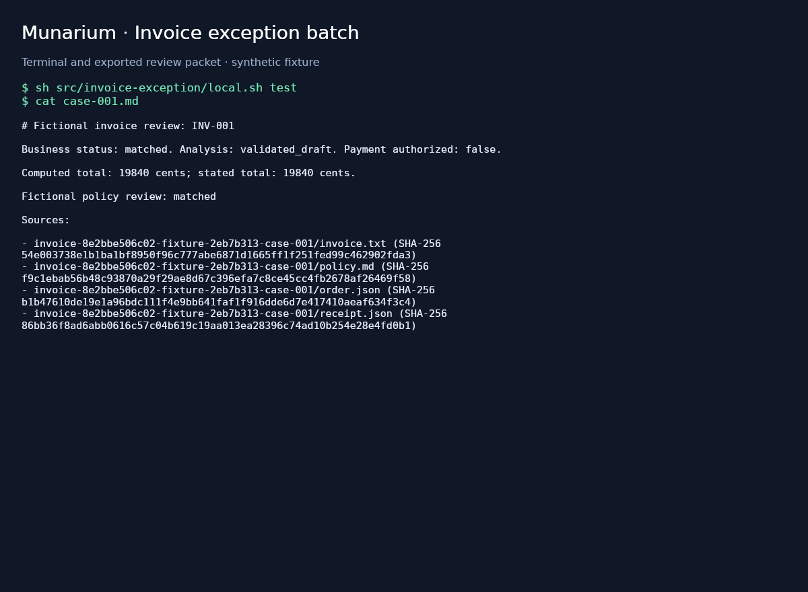

# Invoice exception packet

## Business case

A company processing supplier invoices needs to identify mismatched prices, partial deliveries and missing purchase records before staff approve payment. Reviewing each exception by searching several systems and purchasing policies takes time and can lead to inconsistent decisions. A similar batch solution could perform exact accounting checks, attach the relevant evidence and produce a cited explanation for the accounts-payable reviewer. The business value is a more consistent review queue with less document hunting and a clearer audit trail; payment approval remains with the company's authorized workflow. This synthetic demo does not measure financial savings.

## Application



Rendered terminal and review-packet preview using the demo's generated fictional inputs; this is a CLI output illustration.

To regenerate the PNG, first run this demo's controlled tests to produce a review packet, then build the shared headless renderer with `docker build -t munarium-policy-runner:local src/employee-policy-assistant`. From the repository root, the following command works in PowerShell and POSIX shells; it selects the first sorted controlled `case-001.md`, and `INVOICE_PACKET_PATH` can select another file inside the `/invoice` mount. Review the resulting `artifacts/employee-policy-assistant/previews/invoice-application.png` and copy it to `docs/demos/invoice-exception/application.png`. This renderer is documentation tooling; invoice runtime and tests remain independent of the desktop demo.

```sh
docker run --rm --network none --mount "type=bind,source=$PWD/artifacts/invoice-exception,target=/invoice,readonly" --mount "type=bind,source=$PWD/artifacts/employee-policy-assistant,target=/work" -e POLICY_REPORT_DIR=/work/previews --entrypoint sh munarium-policy-runner:local /app/coordinator.sh preview
```

This Python batch application compares fictional invoices with purchase orders and receipts, then uses the official Munarium client to request a cited explanation from Server 1.1.1. It writes Markdown review packets, JSON evidence sidecars, and a CSV processing summary. Integer arithmetic decides amounts and exceptions; model output cannot authorize payment or replace the calculated delivery status. This is the first Wave 1 implementation; the employee policy desktop assistant is the second.

## Run the local tests

Install Git and Docker Desktop with Linux containers on Windows or macOS, or Docker Engine with Compose on Linux. No host Python installation, second repository checkout, browser application, or paid provider is required for controlled tests. Docker builds the runner from `src/invoice-exception/` and fetches the complete public Munarium checkout at `bb6e92a72a3944cff4d4bf0c1b470afcf3f4dfb3`. Server, PostgreSQL, the Python base image, and Python dependencies are pinned in the Docker and Compose files. Initial image/dependency downloads need Internet access; generated fixtures and controlled tests use only local containers afterward.

From the repository root, run either command:

```powershell
./src/invoice-exception/local.ps1 -Action test
```

```sh
sh src/invoice-exception/local.sh test
```

Both entry points check for a local Linux Docker engine, build the test image, run unit checks, start the isolated services, generate fixtures, bootstrap and approve the case indexes, run application integrations and Python SDK conformance, then export and assess all 20 review packets. Any failed command or unexpected test skip stops the workflow with a nonzero exit code. The four upstream chronology skips are reported separately and do not count as passes. Container names and volumes belong to the `invoice-wave1` Compose project. Existing compatible cached images are reused; unrelated containers are untouched. No service publishes a host port. The included Munarium and database credentials are public, local-test-only values.

The containerized suite is intended to run identically on Windows, Linux, and macOS. Recorded validation on this checkout uses Docker Desktop on Windows with Linux/AMD64 containers. Native Linux, macOS, ARM64, and additional provider/model combinations must be qualified separately before claiming those results. Use the same seed and compare manifest hashes; timing and generated prose can vary with hardware. The controlled workload needs no GPU. Allow space for the Python runner, Server, PostgreSQL, and their build caches. Real AI acceptance uses the three configured online providers; no local completion model is loaded.

Revalidated on 2026-09-10 after moving the source to `src/invoice-exception/` and documentation to `docs/demos/`: 29 application tests passed, including 22 unit cases; 175 Python client unit/conformance tests passed with four documented chronology skips; all 20 controlled invoice packets passed their independent acceptance checks. Repeating the batch in a new container reused all 20 saved responses without another completion. Documentation links, the public-material scan, license checks, and both wrapper syntax checks passed. The application tests took about 7 seconds and SDK tests about 9 seconds after setup. The runner image was approximately 329 MB; the four idle service containers used approximately 125 MiB combined, excluding Docker's VM, build caches, active test runners, and real models. These observations are not measured minimum host requirements or production performance figures.

An earlier single-provider pass used `INVOICE_PROVIDER=openai` and `INVOICE_MODEL=gpt-5.4-mini`. All 20 newly completed invoice packets passed the automated acceptance checks with no uncertain or unverified results. Server reported 12,470 input tokens and 4,294 output tokens. Sample explanations for clean matches, partial and missing receipts, and total mismatches were also inspected; those samples preserved the deterministic amounts and evidence limitations. Results are retained locally under `artifacts/invoice-exception/openai/invoice-8e2bbe506c02-openai-49274c06/`, including `quality.json`. This is one model run on the generated corpus, not a claim of production accuracy.

The distributed cloud suite passed both before and after reorganization. The fresh post-move run executed two tests on OpenAI `gpt-5.4-mini`, two on Anthropic `claude-haiku-4-5-20251001`, and four on OpenRouter `qwen/qwen3.8-flash`, with no reused responses, uncertain outcomes, unverified packets, or failed assertions. Reports are under `artifacts/invoice-exception/cloud/8f810c70c39d4a81bddc0b22c172ff7f/`, with a `quality.json` and `tests.xml` in each provider's subdirectory. Server reported input/output token totals of 1,228/410 for OpenAI, 1,456/433 for Anthropic, and 6,219/8,617 for OpenRouter, including Server retries. These disjoint case assignments establish coverage across providers; they are not a comparative model benchmark.

## What developers should inspect

| Step | Code | Lesson |
|---|---|---|
| Generate inputs | [fixtures.py](../../../src/invoice-exception/invoice_demo/fixtures.py) | Stable seed, fixed logical date, hashes, and a separate oracle |
| Calculate discrepancies | [accounting.py](../../../src/invoice-exception/invoice_demo/accounting.py) | Integer cents, receipt completeness, and batch-wide duplicate detection |
| Publish evidence | [server.py](../../../src/invoice-exception/invoice_demo/server.py), [shape](../../../src/invoice-exception/shapes/documents.yaml), [runbook](../../../src/invoice-exception/runbooks/invoice.yaml) | Apply, ingest, inspect, approve only the intended cutover, mint a scoped capability |
| Process and recover | [batch.py](../../../src/invoice-exception/invoice_demo/batch.py) | Session isolation, durable turn intent, transcript reconciliation, and repeatable local exports |
| Assess results | [quality.py](../../../src/invoice-exception/invoice_demo/quality.py), [tests](../../../src/invoice-exception/tests/test_integration.py) | Independent arithmetic oracle, source resolution, missing-evidence handling, and failure cases |

The generator produces 20 cases: three each of clean matches, partial receipts, missing receipts, price differences, incorrect totals, and missing orders, plus a duplicate pair. Each case has a text invoice, available structured order/receipt exports, and a fictional purchasing policy. The generator uses seed `111`, a fixed `2026-01-15` logical date, UTF-8 and normalized newlines. `manifest.json` records every input hash. The answer key is generated into a separate `oracle` volume; neither the batch, bootstrap, Server, nor provider fixture can read that volume. The controlled provider constructs responses from its request, not from the oracle, and proves protocol wiring rather than AI quality.

Each case gets its own collection and runbook, so another invoice's documents cannot enter its session. Bootstrap namespaces include the input, runbook, shape, provider, and model configuration revisions. The query capability names the allowed runbooks without `@version`, as required by Server 1.1.1; the application creates sessions with exact `name@1` references. Only bootstrap receives operator tokens. A private credentials volume supplies the batch's short-lived query capability, whose uid matches the acting identity.

Server supplies collection/chunk citation labels to the model. The application resolves those labels back to returned source paths and hashes and requires a policy citation. A valid source identifier does not establish that prose faithfully describes the rule: exported drafts still require human review. The automated quality report checks exact calculations, delivery status, citation resolution, and explicit missing-receipt wording; it does not claim complete semantic evaluation.

## Outputs and restart behavior

Find outputs under the ignored `artifacts/invoice-exception/` directory. `bootstrap.json` records fixture hashes, client revision, provider/model, and approved run IDs. Each provider and configuration namespace has its own packet directory with `case-001.md`, `case-001.json`, `summary.csv`, `summary.json`, `quality.json`, and `journal.sqlite`. Unit, integration, and SDK test results are emitted as JUnit XML. Integration failure artifacts use separate run directories.

Inspect a clean match, the partial receipt, and the missing receipt before changing the corpus. The JSON sidecar contains the deterministic result, session ID, actual searched collections, hit text and hashes, index provenance, provider/model identity, and token counts. Missing evidence remains explicit even when a model suggests a different outcome. Unparseable JSON, unserved citations, or an inconsistent proposed action produces an `unverified` packet and a failing batch exit status.

The journal saves a unique job and session ID before dispatching a turn, then saves the response before exporting files. Repeating a completed job regenerates exports from its saved response without a second provider call. An interrupted job remains uncertain until transcript reconciliation finds exactly one completed matching turn. An empty transcript is not permission to resubmit. Run `app reconcile` using the same Compose options and volumes to inspect uncertain jobs. Server 1.1.1 stores completion routing metadata under `resolved`; recovery preserves it and marks recovered evidence explicitly. The transcript does not retain the live response's skipped-collection list, so recovered sidecars omit that field.

If a capability expires, rerun bootstrap to mint a fresh capability for the same uid and runbook scope, then reconcile saved sessions. A crash before recording a newly created session ID requires operator review; this demo does not claim exactly-once Server execution. Keep the journal and corresponding database together. Changing a seed, model, or template creates a distinct configuration namespace rather than overwriting an old result.

## Real AI-provider tests and local keys

The repository's [`.env.local.sample`](../../../.env.local.sample) documents the dotenv format, provider-key placeholders, and explicit provider/model selection. Copy it to `.env.local` only if that local file does not exist:

```powershell
if (-not (Test-Path .env.local)) { Copy-Item .env.local.sample .env.local }
```

```sh
test -f .env.local || cp .env.local.sample .env.local
```

Supply `OPENAI_API_KEY`, `ANTHROPIC_API_KEY`, and `OPENROUTER_API_KEY` for the distributed cloud suite. Set a preferred model independently through `OPENAI_MODEL=gpt-5.4-mini`, `ANTHROPIC_MODEL=claude-haiku-4-5-20251001`, and `OPENROUTER_MODEL=qwen/qwen3.8-flash`. Haiku uses its [pinned snapshot ID](https://platform.claude.com/docs/en/about-claude/models/model-ids-and-versions); the Qwen selection is [Qwen3.8 Flash](https://openrouter.ai/qwen/qwen3.8-flash). `.env.local` is ignored by Git and excluded from Docker build contexts. Cloud Compose loads it explicitly and supplies provider keys only to Server; bootstrap receives model names, and neither the application nor the test runner receives provider keys. `INVOICE_PROVIDER` and `INVOICE_MODEL` remain available for a manual single-provider bootstrap; they do not select the distributed suite's models.

Once all three keys and preferred models are ready, run the optional cloud suite:

```powershell
./src/invoice-exception/local.ps1 -Action cloud
```

```sh
sh src/invoice-exception/local.sh cloud
```

The suite recreates the test Server with the supplied environment, checks each named provider, and bootstraps separate provider/model namespaces. It executes eight distinct invoice tests across the three providers, using the assignment in the source module `invoice_demo/cloud_plan.py`:

| Provider | Cases | Acceptance scenarios |
|---|---|---|
| OpenAI | 001, 003, 005 | Clean match, missing-receipt abstention, and incorrect total |
| Anthropic | 002, 004, 006 | Partial receipt, price variance, and missing order |
| OpenRouter | 019, 020 | Both duplicate submissions, independently asserted |

Each new OpenRouter submission waits 60 seconds before creating its session. Completed exports and transcript reconciliation do not incur that pause or a new completion. Each invocation has a fresh run ID under `artifacts/invoice-exception/cloud/`, with packet files, an independent quality report, and JUnit XML for each provider. Every assigned case must pass, and each provider executes at least two tests. Missing keys, failed provider setup, absent packets, wrong provider/model identities, and unexpected skips fail the suite. A failed provider does not prevent the remaining providers from being exercised. Case selection happens after whole-corpus duplicate detection, so selecting a subset cannot hide duplicate invoices. Fresh cloud runs request new completions; interrupted jobs within the same run retain their journal for explicit reconciliation.

Model query expansion is absent from this runbook. Completion output is capped at 768 tokens per initial call; Server may make a truncation retry with a larger budget. Provider token usage is reported, not converted to currency. The suite uses only generated fictional inputs and incurs provider usage. Controlled outage tests remain part of the keyless suite; they are not repeated against paid providers. The full 20-case controlled suite remains separate from the eight-case distributed cloud suite.

Real AI acceptance uses only OpenAI, Anthropic, and OpenRouter through the explicit cloud action. The default controlled fixture returns canned protocol responses and loads no model. Run both test and cloud for complete application and AI qualification; no Ollama container or model download is required. Ollama support in the original web demo is unchanged.

## Smaller runs, cleanup, and extending the corpus

For individual steps, work from `src/invoice-exception` and prefix the service commands with `docker compose --env-file ../../.env.local.sample -p invoice-wave1 -f compose.yaml`. Useful commands are `run --rm --no-deps tests unit`, `run --rm --no-deps app process --limit 1`, and `run --rm --no-deps app reconcile`. A partial run does not satisfy full-corpus acceptance. `bootstrap --approve` is the explicit local-test cutover approval; a bootstrap without that flag records the pending run and stops.

Use `local.ps1 -Action stop` or `local.sh stop` to stop this project's containers while retaining evidence and database state. `docker compose --env-file ../../.env.local.sample -p invoice-wave1 -f compose.yaml down` removes its containers/network and retains named volumes. Adding `--volumes` also removes this project's database, generated inputs, oracle, and capabilities; do so only when deliberately discarding the local test state. Host artifacts remain available for review. Do not apply these cleanup commands to a shared development stack.

For another seed or larger workload, choose a fresh `invoice-...` project, run its generator with `generate --seed 112 --groups 10`, and retain its manifest and oracle. The generator refuses to overwrite nonempty directories or silently change an existing profile. Extend the generator's declared scenario rules and its independently authored expectations together, add unit/integration cases, then inspect real model output. Do not ingest generated explanations or answer keys as purchasing policy.

The Python source and original templates in src/invoice-exception use Apache-2.0. Runtime dependency versions are recorded in [requirements.lock](../../../src/invoice-exception/requirements.lock); their upstream licenses and notices are retained in the installed distributions and pinned Munarium checkout. All business inputs are newly generated fictional material, with no reuse of the web demo or its bundled datasets.

## Online-only workflow recheck

After removing real local-model testing on 2026-09-10, all 29 application tests, 175 SDK tests (four documented chronology skips), and 20 controlled invoice cases passed again. The fresh cloud run 52f7978dd3b74b44882ff4550fd582a0 passed both OpenAI cases, both Anthropic cases, and three of four OpenRouter cases. OpenRouter case-005 remained uncertain with no recoverable completed transcript; its packet was absent and the cloud action correctly failed. Explicit reconciliation reused the three completed packets without another AI call and preserved the unresolved case. Initial failed reports remain as tests-initial.xml and quality-initial.json in that run's OpenRouter directory. This latest run is not a complete cloud pass; the earlier successful run above remains historical evidence. No paid turn was blindly retried.


On 2026-09-11, the rebalanced cloud run `c617074b08ce45c8ba1503b685d503cc` passed all eight fresh cases with a 3/3/2 OpenAI/Anthropic/OpenRouter allocation and 60-second pacing before each OpenRouter submission. No response was reused, uncertain or unverified. Recorded input/output tokens were 1872/558 for OpenAI, 2089/641 for Anthropic, and 2329/3493 for OpenRouter. The isolated `invoice-balancecheck` controlled run passed 29 application tests, 175 SDK tests with four documented chronology skips, and all 20 business cases. Prior failed and historical cloud runs remain recorded above.
