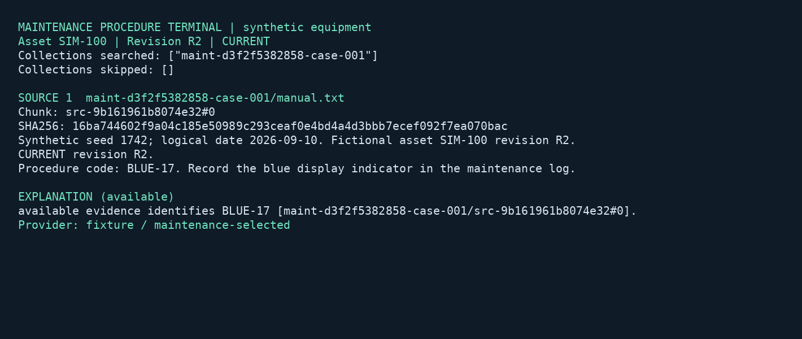

# Maintenance procedure terminal

## Business case

A company maintaining equipment across several sites needs technicians to find the manual that applies to the exact asset revision in front of them. Searching a shared document store can surface obsolete instructions or hide a missing inspection record. A similar terminal could make revision selection explicit, keep source inspection usable during an AI-provider outage and offer a cited explanation when requested. The business value is quicker access to applicable evidence and a clearer distinction between current procedures, historical material and missing documentation. Qualified staff retain responsibility for maintenance decisions; this fictional display-equipment demo does not demonstrate operational safety or measured downtime savings.

## Application

This Rust/Tokio terminal finds maintenance evidence for an explicitly selected fictional asset revision. `find` retrieves sources without calling a model. The separate `explain` action requests a cited explanation. Current and historical revisions remain visibly distinct, and unsupported assets or revisions produce no procedure.



The image renders actual saved terminal output with container fonts. It is a terminal rendering, not an operating-system screenshot. The equipment and documents are synthetic; the controlled provider returns canned protocol responses.

Source and isolated harness: [src/maintenance-terminal](../../../src/maintenance-terminal). The original web demo is outside this application's workflow.

## Run locally

Use Git and Docker Desktop with Linux containers on Windows/macOS, or Docker Engine with Compose on Linux. No host Rust installation is required. The runner uses Rust 1.98 and a complete official client checkout at `bb6e92a72a3944cff4d4bf0c1b470afcf3f4dfb3`. Server 1.1.1, PostgreSQL/pgvector and the Rust image are pinned by digest. [Cargo.lock](../../../src/maintenance-terminal/Cargo.lock) locks the app dependencies; the SDK uses its own upstream lockfile. Cargo runs offline after image provisioning.

From the repository root:

| Action | PowerShell | POSIX shell |
|---|---|---|
| Complete keyless suite | `./src/maintenance-terminal/local.ps1 -Action test` | `sh src/maintenance-terminal/local.sh test` |
| All three online providers | `./src/maintenance-terminal/local.ps1 -Action cloud` | `sh src/maintenance-terminal/local.sh cloud` |
| Stop containers, retain state | `./src/maintenance-terminal/local.ps1 -Action stop` | `sh src/maintenance-terminal/local.sh stop` |

The default project is `maintenance-wave1`. Use `-Project maintenance-cleanroom` or the second POSIX argument `maintenance-cleanroom` for empty project volumes. Wrappers require a local Linux Docker context and publish no host ports. They record host/image identity, the source revision, commands, fixture manifests, reports and business outputs under ignored `artifacts/maintenance-terminal/`. Failed runs are retained. No command resets volumes or touches another demo's project.

The default suite does not read `.env.local`. Its generator and unit service have no network. The private oracle volume is mounted only by the generator and qualification service; the terminal, Server and provider fixture cannot read it. The keyless fixture speaks the Ollama wire protocol but runs no Ollama process, downloads no models and performs no inference.

The explicit cloud action reads the existing ignored repository-root `.env.local` and requires `OPENAI_API_KEY`, `ANTHROPIC_API_KEY`, and `OPENROUTER_API_KEY`. If necessary, copy [`.env.local.sample`](../../../.env.local.sample) to a new `.env.local` without overwriting an existing file, then fill the keys. Only Server receives provider keys. Bootstrap receives preferred model names; the app receives a short-lived query capability. Each cloud invocation uses fresh case directories and attempts all three providers even if one fails. OpenRouter waits 60 seconds before each independent case; `MAINTENANCE_OPENROUTER_CASE_DELAY_SECONDS` changes that spacing. Submitted turns are never automatically retried.

## Use the terminal

After `test` has provisioned the project, run from `src/maintenance-terminal/`:

```sh
docker compose --env-file ../../.env.local.sample -p maintenance-wave1 run --rm --no-deps app
```

Type the following commands in its line-oriented terminal interface:

```text
find SIM-100 R2
source 1
explain
export
find SIM-100 R1
source 1
find UNKNOWN R2
quit
```

`find` shows the selected revision, actual searched/skipped collections, source paths, chunk IDs, SHA-256 hashes and excerpts. `source N` opens a returned source record. R1 is clearly historical; it is never presented as an applicable current procedure. An unsupported selection clears the previous selection, so a subsequent `explain` cannot accidentally use stale evidence. `export` shows the evidence/output directory.

For scripts, use the plain stdout commands with an explicit persistent directory:

```sh
docker compose --env-file ../../.env.local.sample -p maintenance-wave1 run --rm --no-deps -T app find SIM-100 R2 /work/manual/example
docker compose --env-file ../../.env.local.sample -p maintenance-wave1 run --rm --no-deps -T app explain SIM-100 R2 /work/manual/example
docker compose --env-file ../../.env.local.sample -p maintenance-wave1 run --rm --no-deps -T app reconcile SIM-100 R2 /work/manual/example
```

These commands also work in PowerShell. Use a fresh directory for a new explanation. Reusing a completed directory restores its saved output. Reusing an uncertain directory inspects its transcript and never resubmits the turn. Renew expired query credentials by rerunning bootstrap for the same provider/model; retain the original uid, configuration and intent. The tutorial's bootstrap issuer represents the authenticated token broker an organization would supply.

## Official client walkthrough

[bootstrap.rs](../../../src/maintenance-terminal/src/bootstrap.rs) calls the official Rust SDK to apply a named provider configuration and check `providers.health`, apply the shape and runbooks, ingest the generated documents, run indexing, inspect pending steps and approve only the recorded collection's cutover. Capabilities contain bare runbook names; `sessions.create` pins `name@1`. The uid matches the capability subject.

Trusted catalogue entries choose each asset/revision's collection and two runbooks. The retrieval runbook omits all model tasks and completion configuration. [terminal.rs](../../../src/maintenance-terminal/src/terminal.rs) calls `sessions.turn` with `complete: Some(false)` and `model_override: None`. This also avoids paid query expansion. The explain runbook selects the named OpenAI, Anthropic or OpenRouter configuration, preferred model, explicit `fast` tier and a 768-token answer budget. It configures no query expansion.

The application persists selection and evidence before enabling explain. It creates a separate completion session and atomically saves an uncertain intent before `sessions.turn_stream`. It displays real phase progress, saves the full response before validation, then writes the verified explanation and evidence sidecar. Returned collections, envelopes, verification results, actual provider/model and total completion tokens remain available in the JSON artifacts. Scores are retrieval ranks, not confidence percentages.

On response loss, `sessions.get` must contain exactly one matching completed turn. Recovery checks the saved selection, uid, configuration and nested `completion.resolved.provider`. It preserves routing metadata and marks recovered evidence; unavailable live skipped-collection metadata is omitted. Empty or ambiguous transcripts remain uncertain. The fault proxy lets Server finish a turn and removes the final SSE result in transit, exercising actual SDK incomplete-stream handling. No machine-control commands are implemented.

## Corpus and acceptance

The native Rust generator produces a trusted catalogue and 24 documents: a manual or missing-manual notice, inspection note and revision notice per case. Seed 1742 and logical date 2026-09-10 yield deterministic bytes. Independent generator processes must produce identical files and private oracle data. The oracle is never ingested.

| Case | Asset/revision | Expected evidence outcome | Online provider |
|---|---|---|---|
| 001 | SIM-100 R2 | Available; BLUE-17 | OpenAI `gpt-5.4-mini` |
| 002 | SIM-100 R1 | Historical; AMBER-12 | Anthropic `claude-haiku-4-5-20251001` |
| 003 | SIM-101 R2 | Available; GREEN-23 | OpenRouter `qwen/qwen3.8-flash` |
| 004 | SIM-101 R1 | Historical; VIOLET-09 | Anthropic `claude-haiku-4-5-20251001` |
| 005 | SIM-102 R2 | Insufficient; request inspection | OpenAI `gpt-5.4-mini` |
| 006 | SIM-102 R1 | Historical; SILVER-08 | Anthropic `claude-haiku-4-5-20251001` |
| 007 | SIM-103 R2 | Insufficient; request manual | OpenAI `gpt-5.4-mini` |
| 008 | SIM-103 R1 | Historical; WHITE-04 | OpenRouter `qwen/qwen3.8-flash` |

The complete controlled corpus runs all eight cases. Cloud uses the preferred 3/3/2 balance, with at least two independently asserted cases per provider. Every case must match the private oracle's exact status, revision and procedure code. The explanation must identify that code and cite the returned source that contains it. Every citation must resolve; source paths and content hashes must match the scoped inputs. Live provider family, model, stored named configuration and nonzero usage are checked. Remaining Server verification violations fail validation. These are bounded synthetic grounding checks, not a general model benchmark.

Additional checks cover unsupported selections, retrieval during provider outage with zero provider calls, unavailable completion without resubmission, typed access denial, real capability expiry including Server's 30-second clock-skew allowance, same-uid refresh, lost SSE completion, repeated exports, terminal interaction and a dedicated Server restart. Application format, Clippy and unit checks run natively. The official SDK's format, Clippy, unit and REST/gRPC conformance suites run serially against the same isolated Server. Failed checks, missing results and unexpected skips fail the coordinator.

Each provider directory contains individual case evidence, intents, progress, responses, transcripts, explanation exports, `quality.json` and JUnit `tests.xml`. Rust unit and conformance logs are also converted into machine-readable reports. Server completion token totals include its internal retries. No separate expansion tokens occur because expansion is disabled.

## Rendering and qualification

The controlled wrapper writes `<run>/application.png` from `controlled/case-001/answer.txt`. [support.py](../../../src/maintenance-terminal/support.py) uses Pillow and DejaVu fonts solely for rendering actual output and translating native test reports. Application behavior, fixture generation and SDK integrations are Rust. Preserve upstream runtime/dependency licenses when distributing the runner. Original synthetic material and the rendering are Apache-2.0 demo assets.

To render an existing captured answer again, run this from `src/maintenance-terminal/`, replacing `RUN` with its report directory, then inspect the PNG before copying it into this documentation folder:

```sh
docker compose --env-file ../../.env.local.sample -p maintenance-release run --rm --no-deps --entrypoint python3 app /app/support.py render /work/test/RUN/controlled/case-001/answer.txt /work/test/RUN/application.png
```

On 2026-09-10 (America/Denver), `./src/maintenance-terminal/local.ps1 -Action test -Project maintenance-release` passed with fresh project volumes. Reports are under `artifacts/maintenance-terminal/test/3b7dcab26c9b430dbead77f4e0643f37/`.

| Coverage | Recorded result |
|---|---|
| Application unit tests | 7 passed; format and Clippy passed |
| Independent fixture generation | Two network-disabled processes produced identical corpus and private-oracle files |
| Real-Server controlled tests | 16 passed, including all eight business scenarios |
| Dedicated Server restart and export recovery | 1 passed; no repeated completion |
| Official Rust SDK unit/doc tests | 40 passed; format and Clippy passed |
| Official SDK REST/gRPC and platform conformance | 39 passed |
| Rendering | Actual output rendered and visually inspected |

There are no test skips. The upstream Rust suite does not implement the kernel-only chronology scenario because it has no corresponding wire form; that coverage gap is recorded separately and is not counted as a pass. The app uses an operating-system file lock per output directory to reject concurrent use; process exit releases the lock while preserving uncertain intents.

The initial controlled run `test/ef656eff46ec45f7ab48c3daefdf053e/` failed four historical cases because the canned fixture misread a revision warning. The application rejected those answers; the fixture was corrected and a native regression test added. Earlier complete controlled runs remain under `test/3081cde3b4894984bf982a2da4086df1/` and `test/9a0bf26c5059428cab16a7adc1983dbc/`. The report parser was also corrected to include the SDK's passing documentation compile test in its machine-readable total.

Two earlier online qualifications remain preserved. `cloud/c428761df4f5431291c68bfdd18f2e96/` passed 1 of 8 cases because validation unnecessarily required every listed supporting source to be repeated inline. Citation validation now allows additional verified supporting sources, rejects invented inline labels, and requires an inline citation to the source containing the procedure code. `cloud/ec8e7052152a4b558d07d739654db227/` then passed 6 of 8 cases: two Anthropic historical answers cited a revision notice instead of the code-bearing manual. Those answers correctly failed grounding validation. The final prompt focuses the explanation on the manual's procedure-code line. Neither failed run is combined with another run to claim a pass.

The final online qualification, `./src/maintenance-terminal/local.ps1 -Action cloud -Project maintenance-cloud-release`, passed all eight fresh cases with no skips or unresolved outputs. Reports are under `cloud/a3296d34c6ad4a789cdbe9b200c1e29a/`: three cases on OpenAI `gpt-5.4-mini`, three on Anthropic `claude-haiku-4-5-20251001`, and two on OpenRouter `qwen/qwen3.8-flash`. The wrapper also passed seven unit tests and exited successfully. OpenRouter used the 60-second case delay. Its progress records include Server's bounded truncation retries; saved completion usage includes those calls.

The POSIX wrapper passed the same complete controlled suite from a fresh detached checkout of validation snapshot `cb0d53358172cdb54f739b8fca55223a7961a282`, with no `.env.local` file and empty `maintenance-cleanroom` project volumes. Its Rust source matches the finished application. The invocation used Git Bash on Windows with `MSYS_NO_PATHCONV=1` and `sh src/maintenance-terminal/local.sh test maintenance-cleanroom`. Reports were copied to `test/20260911T023852Z-27a4d937e4dbab01/`; the original checkout and reports remain under `artifacts/maintenance-terminal/cleanroom-checkout/`. PowerShell, fresh-checkout POSIX and online runs produced the identical manifest SHA-256 `086a222babe0c3b180b8d896ec5413ee68cafb984607729ce629f6d2ebd3ee6d`.

Documentation links, public-material and license checks, PowerShell parsing and POSIX syntax checks passed. Host evidence establishes Docker Desktop on Windows with Linux/AMD64 containers, 12 assigned CPUs and 31.3 GiB of memory. The development/test runner is approximately 5.8 GB, including the Rust toolchain, complete source checkout and compiled SDK/test dependencies; allow additional space for Docker build cache and other service images. These are observed environment details, not measured minimum requirements. Native Linux/macOS hosts and ARM64 remain pending.


Shared [capacity checks, workload measurement, image download sizes and native-host checklist](../../demo-qualification.md) apply to this demo. Reports describe the selected profile and retain failed outcomes.

## Held-out and stress profiles

The [profile definitions](../../../src/maintenance-terminal/fixture-profiles.json) select `default` (seed 1742, eight asset/revision cases), `heldout` (seed 81742, eight cases with changed procedure codes), or `stress` (seed 91742, 80 cases and 240 documents). Stress covers 40 assets with current and historical revisions, repeating the eight authored scenario types with independent scoped collections. Every generated case is checked against its private status, procedure code and revision expectation. The larger fixture increases ingestion and session work; it is not 80 distinct business scenario types.

The native generator records generator/template revisions, profile, seed, case/document counts, logical date, UTC, locale and hashes. Its unit checks confirm corpus size and changed held-out expectations; the coordinator invokes two separate network-disabled generator processes for every profile and compares all corpus and oracle bytes. Generation refuses a different profile in existing input state. Real-provider qualification requires default fixtures; only the canned provider budget scales with corpus size.

Run `./tools/measure_demo.ps1 -Demo maintenance-terminal -Project maintenance-heldout -Profile heldout`, or `sh tools/measure_demo.sh maintenance-terminal maintenance-stress stress`, using new project state.

On 2026-09-11, the following complete profiles passed:

| Profile and entry point | Measurement ID | Application checks | Elapsed | Sampled peak CPU | Sampled peak memory |
|---|---|---:|---:|---:|---:|
| Held-out, PowerShell | `e7d74d332df84da8991a575a354f49a7` | 25 | 198.09 s | 209.61% | 721,210,572 bytes |
| Stress, POSIX | `20260911T081858Z-cfb1ee9f81063c8e` | 97 | 242 s | 208.01% | 695,205,888 bytes |
| Default, final fresh checkout through Ubuntu WSL | `20260911T082221Z-676e60e805ad9486` | 25 | 163 s | 203.64% | 705,691,648 bytes |

Each profile also passed Rust formatting/Clippy and all 79 official SDK checks, with no skips and the previously documented kernel-chronology coverage gap. The final fresh checkout used snapshot `d14c72645d84040b748393f2405439f3b2f30a0a`, identical to the final source, and empty project state. Its test ID is `20260911T082222Z-a1480d3fef03bbdf`. Held-out and stress test IDs are `47b70d6e3caa4abc814a93568a2d3d4b` and `20260911T081859Z-775f23c38b0b70d9`. An earlier fresh-checkout run also passed under `20260911T081840Z-f7034e6175c5d509`; the final run includes the subsequent status-message correction from “eight” to “selected” scopes. No workflow logic changed in that correction.

Cloud run `2456c4fcb2964c32b5b1b9f8e3f9018a` passed eight fresh cases: three OpenAI, three Anthropic, and two OpenRouter, with 60-second OpenRouter pacing. The reports retain actual model identities, completion usage and bounded Server retries. Earlier failures remain distinct from these passing runs.

The held-out project's retained volumes occupy 53,769,201 logical bytes; stress occupies 84,891,969 bytes. The development runner is 5,800,666,280 bytes unpacked. Measurements used isolated projects on a shared host with other qualification work active; elapsed times include cache/build effects. Sampled CPU uses 100% per core; memory excludes host/VM/build-daemon overhead and may miss brief peaks. The shared guide records compressed base-image transfers separately. WSL exercises Linux userspace with Docker Desktop; native Linux/macOS, native ARM64 and Apple Silicon emulation remain unqualified.
