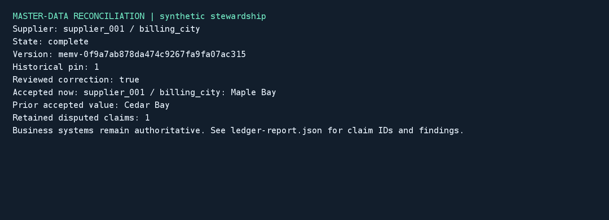

# Master-data reconciliation

## Business case

Companies often receive different supplier details from purchasing, finance and regional directories. A steward must determine whether two rows describe the same supplier, explain the discrepancy, and preserve the reason for any correction. A similar CLI could prepare a consistent review packet and retain both conflicting submissions and approved changes. Plausible benefits include less repeated investigation and clearer accountability for directory maintenance; this synthetic demo measures neither productivity nor financial outcomes. People remain responsible for source truth and approvals, and existing ERP or master-data systems remain responsible for operational updates.

## Application

This Java 21 CLI normalizes supplier keys in two CSV exports, retrieves a field-specific stewardship policy and generates a cited draft. A separate review command records a named decision and reason. A trusted import command then creates a ledger version, records the original value and disputed competing value, and optionally proposes an approved correction. It exports current and historical accepted facts, disputes and gate findings.



The image is a Java2D rendering of actual captured CLI status, not an operating-system screenshot. Source, native JUnit tests, synthetic generator and isolated Docker configuration are in [src/master-data-reconciliation](../../../src/master-data-reconciliation).

## Run locally

Use local Docker with Linux containers and Compose. Dependencies are downloaded during the first build: the pinned Java 21 image, complete official Munarium checkout `bb6e92a72a3944cff4d4bf0c1b470afcf3f4dfb3`, Gradle distribution and locked application dependencies. Server 1.1.1 and pgvector are pinned by digest. Subsequent test commands use Gradle offline mode. No host JDK or database installation is required.

| Action | PowerShell from repository root | POSIX from repository root |
|---|---|---|
| Keyless build and complete controlled suite | `./src/master-data-reconciliation/local.ps1 -Action test` | `sh src/master-data-reconciliation/local.sh test` |
| Three-provider real AI qualification | `./src/master-data-reconciliation/local.ps1 -Action cloud -Project reconcile-cloud` | `sh src/master-data-reconciliation/local.sh cloud reconcile-cloud` |
| Stop project, retaining evidence and volumes | `./src/master-data-reconciliation/local.ps1 -Action stop` | `sh src/master-data-reconciliation/local.sh stop` |

The default project is `reconcile-wave2`. Supply another `reconcile-` project name for empty isolated volumes. Run one invocation per project at a time. Test reports and application state live beneath `artifacts/master-data-reconciliation/`; each wrapper invocation creates a new run directory. No host service port is published. The default suite never reads `.env.local`. The protocol fixture emits canned JSON from supplied evidence and runs no local model. Its service, the application and the Server cannot mount the private oracle.

After the controlled suite has provisioned the tutorial, run the following from `src/master-data-reconciliation/`:

```sh
docker compose --env-file ../../.env.local.sample -p reconcile-wave2 run --rm --no-deps app prepare /work/manual/case-001 case-001
docker compose --env-file ../../.env.local.sample -p reconcile-wave2 run --rm --no-deps app review /work/manual/case-001 approve demo-steward "Reviewed both exports and the directory approval"
docker compose --env-file ../../.env.local.sample -p reconcile-wave2 run --rm --no-deps writer import /work/manual/case-001
docker compose --env-file ../../.env.local.sample -p reconcile-wave2 run --rm --no-deps app status /work/manual/case-001
```

Inspect `artifacts/master-data-reconciliation/manual/case-001/draft.md` and `draft.json` before recording the review. Use `reject` instead of `approve` to retain the original accepted value. The import still records the competing source value as disputed; rejection does not turn it into an accepted fact. The review file binds the decision to the exact draft and input hashes. A changed decision requires a new work item, preserving the original review history. The tutorial's reviewer label is local attribution, not enterprise authentication; replace it with an authenticated review workflow in a deployed system.

The CSV contract is deliberately narrow: a header and three unquoted columns (`supplier,field,value`), one field per supplier. Unicode NFKC, case folding and separator normalization map aliases to a canonical key. Duplicate normalized keys, unmatched key sets, different field mappings, quoted fields and blank values require steward handling before model work. This demo is not a general CSV importer.

## SDK integration and recovery

[Bootstrap.java](../../../src/master-data-reconciliation/src/main/java/io/ioka/demo/reconcile/Bootstrap.java) applies the retrieval and claim shapes, named provider configuration and eight separate runbooks. It uploads synthetic policies, checks each build and explicitly approves its intended cutover. It issues a short-lived query capability bound to the application's uid and bare runbook names. Runbook and token administration stay with bootstrap. Ledger imports use a separate trusted write credential; a query capability cannot write arbitrary facts.

[Workflow.java](../../../src/master-data-reconciliation/src/main/java/io/ioka/demo/reconcile/Workflow.java) uses one scoped session per draft and native REST progress events. Before dispatch it saves the normalized rows, input hash, configuration identity, query and session ID. It saves the response before exporting files. Repeating completed work restores its export without another completion. A lost response leaves the item uncertain; `recover WORK` accepts only one matching completed transcript with the expected uid, runbook and provider configuration. Empty or ambiguous transcripts stay uncertain. Recovered evidence omits the unavailable live skipped-collection list.

[LedgerImport.java](../../../src/master-data-reconciliation/src/main/java/io/ioka/demo/reconcile/LedgerImport.java) uses typed `ClaimInput` values with `reconcile-record@1`. It saves each command body, expected head and idempotency key before submission, and records claim IDs, disputes and findings afterward. The evidence object carries a reconciliation command marker and input hash; provenance uses the supported `backfilled` or `repaired` value, and connector `origin` remains absent. A block-severity conflict is a successful recorded dispute, not an exception or a claim silently discarded.

Server 1.1.1 also records a claim that violates its shape as disputed, with a `shape.schema-violation` block finding. The integration test verifies that the malformed claim remains inspectable but does not enter accepted facts. Applications must inspect returned outcomes instead of assuming that every governance failure throws an exception.

The durable write loop follows the SDK's head-conflict contract while owning the keys so they can be checkpointed before dispatch. Only a typed `HeadConflictException` causes a fresh read and rebuilt attempt with a new key. A correction additionally checks that the accepted value still matches the reviewed baseline. The tests separately exercise the official `proposeClaimWithRetry` helper against a real concurrent write. Identical confirmed completed commands may replay their saved key and body; uncertain commands cannot. `reconcile WORK baseline` can adopt a uniquely matching recorded claim by its command evidence and body, then the import can continue. An ambiguous version-creation response remains blocked for operator investigation because the application has no confirmed version identity to query.

Historical reports use the positive sequence saved when the baseline was accepted. Corrections name `supersedesId`; they do not overwrite the earlier claim. Current accepted facts exclude disputed claims, while a historical pin retains the earlier accepted value. Ledger acceptance reports governance behavior and is never presented as proof that an export is factually correct. The application uses exclusive work-directory leases, flushed temporary files and atomic replacement; it does not coordinate external writers beyond optimistic concurrency.

## Synthetic and online qualification

The generator uses seed 6091, versioned templates, an explicit UTC logical date and locale-independent formatting. It creates eight policy documents, two conflicting exports, a hash manifest and a separately mounted answer key. Two independent JVM processes must generate identical manifest and oracle bytes. Scenarios cover billing city, currency, payment terms, contact ownership, delivery site, Unicode display names, missing regional approval and ambiguous bank-review ownership. The generator and unit-test containers have networking disabled.

Every business case asserts the independent recommendation, citation resolution, policy revision and source hash, absence of ledger work before review, the retained dispute, the approved or rejected current value, the pinned prior value and completed-work replay. Failure tests cover access denial, expiry, provider outage, lost turn and claim responses, concurrent head changes, completed-command idempotency, invalid shapes, changed review inputs and continuation after a process is forcibly halted and Server restarts. JUnit XML, quality JSON, raw progress/completions, review files, command journals and ledger reports remain in the run bundle. The coordinator fails on missing tests, failures or unexpected skips; the Java SDK's kernel-only chronology skip is reported separately.

For the optional cloud action, use the shared ignored root `.env.local`. If it does not exist, copy `.env.local.sample` with `Copy-Item .env.local.sample .env.local` or `cp .env.local.sample .env.local`, then fill the three keys. Preserve an existing file. Use `KEY=value` dotenv assignments and single-quote values containing spaces, `#` or `$`. Compose passes keys only to Server, where named provider `credentialRef` values resolve them. The generator and application never receive the key file.

| Provider | Preferred model | Cases |
|---|---|---|
| OpenAI | `gpt-5.4-mini` | 001, 003, 005 |
| Anthropic | `claude-haiku-4-5-20251001` | 002, 004, 006 |
| OpenRouter | `qwen/qwen3.8-flash` | 007, 008 |

Model names come from the corresponding `*_MODEL` variables. Each OpenRouter case waits 60 seconds before dispatch. The runbook sets an initial completion budget of 3072 tokens and configures no model query expansion. Server may re-ask a truncated completion once with four times that budget; raw progress and cumulative completion usage retain those costs. The application adds no paid-turn retries. Every online invocation has new work directories and sessions, so cached drafts cannot satisfy it. Exact completion model, provider, usage and verification results are retained in each provider's quality records, with management usage reports captured before and after the acceptance suite. These disjoint workloads establish coverage, not a comparative model benchmark. The wrapper attempts the other providers after a failure and returns a failing overall status when any required provider or case fails. There is no local inference fallback.

## Recorded validation

The final concurrency audit added two separate worker containers with a barrier that makes both read ledger head zero before writing. Exactly one receives a typed head conflict and saves a new head and idempotency key; both replay their completed commands without advancing the ledger. PowerShell run `e545384883014dcb97ff5b6a4d4c779b` and fresh-checkout POSIX run `20260911T064856Z-8249e04226e38d50` from snapshot `4842feb236b127ca2391b6d37d5086534fcc4b65` passed all 26 application checks and 63 SDK checks with the same documented skip. The fresh project used empty `reconcile-raceclean` volumes and regenerated the same fixture manifest. This keyless test addition does not change the previously qualified cloud workflow.

PowerShell run `5eb6d6e0fdfe4eaeb7b56d0c9da8432d` passed all 25 application checks: six generator/parser tests, eight independent business scenarios, ten failure and governance integrations, and one continuation after Server restart. All 63 Java SDK tests passed; the single chronology skip is a documented kernel-only check without a public API. The build enforces Java compiler lint with warnings as errors, and the SDK build includes its documentation checks. PowerShell and POSIX syntax, documentation links, licenses and public-material checks passed.

Earlier runs remain in the artifact tree: `fb81b1b08be24228bc5e39fa08c211ef` failed one generator reproducibility assertion because map serialization order differed between JVMs; `fbc5b9e856c94b018f8ea6ba7dc14a51` failed 12 integration cases because an application marker was incorrectly supplied as a provenance enum; `4c2bff57810049cfb36f72f87338f7dc` passed all eight business cases and nine other integrations but failed a test that expected a schema violation to throw instead of returning a recorded dispute. The implementation and tests now use the verified contracts. These failed runs are not successful full qualifications.

Fresh checkout `93fb94e63ba49849653f9f8876fd5bfe4845b951` repeated the complete keyless suite through Git Bash's POSIX wrapper with empty `reconcile-cleanroom` volumes and no `.env.local`. Run `20260911T034156Z-5cc08bbc3dc5d2b0` passed the same 25 application and 63 SDK checks with one documented skip, and regenerated a byte-identical fixture manifest. Its runner image is `sha256:0f28243944cf595c631441989af5d7e84674ac6f20b089efc3abc44a521716e3`. Docker Desktop exposed Linux/x86_64, 12 CPUs and about 31.3 GiB memory; this describes the test environment, not minimum requirements.

Cloud run `63fb7bd91a9a424185fb945d32bb867e` passed three OpenAI cases, three Anthropic cases and OpenRouter case 008. OpenRouter case 007 returned an upstream 429 rate-limit error followed by a 504 gateway timeout. Transcript inspection found no recoverable completion; its journal remains uncertain, and the coordinator correctly failed the run. This seven-case pass is not a complete three-provider qualification. The original request was not resubmitted.

Fresh cloud run `c5de746ffceb49439735346c0be64852` passed all eight cases: three on OpenAI `gpt-5.4-mini`, three on Anthropic `claude-haiku-4-5-20251001`, and two on OpenRouter `qwen/qwen3.8-flash`. Every case passed its independent business and source assertions and recorded the expected model identity. No case was skipped or recovered from an earlier run. The earlier OpenRouter failure remains recorded separately.

Recorded completion usage was 817 input / 304 output tokens for OpenAI, 965 / 425 for Anthropic, and 727 / 1409 for OpenRouter. These are the measured tokens for the disjoint final workloads, not prices or a comparison of provider efficiency.

Native Linux/macOS hosts and ARM64 remain pending. A Docker Desktop Windows pass with Linux/AMD64 containers does not establish native host qualification. Runtime dependencies retain their own licenses; the synthetic fixtures, walkthrough and output rendering are Apache-2.0 demo material.


Shared [capacity checks, workload measurement, image download sizes and native-host checklist](../../demo-qualification.md) apply to this demo. Reports describe the selected profile and retain failed outcomes.

## Held-out and stress profiles

The [profile definitions](../../../src/master-data-reconciliation/fixture-profiles.json) select `default` (seed 6091, eight supplier pairs), `heldout` (seed 86091, eight pairs with changed values and policy revisions), or `stress` (seed 96091, 80 pairs and 80 procedures). Each pair contains one mapped field in each export. Stress repeats the eight authored field/review scenarios with unique supplier identifiers. Seeded currency codes remain valid three-letter codes and payment terms remain numeric. Every pair is checked against private expected review decisions, current/historical values and source revisions.

Manifests record seed, generator/template revisions, profile, both export row counts, document count, logical date, timezone, locale and hashes. Three native tests compare all corpus and oracle bytes across separate JVMs and assert profile cardinality and changed business values. Generation refuses a different profile in existing input state. Online qualification requires the default corpus; only the canned provider request budget scales for stress. The two real competing-worker containers remain part of every controlled profile.

Run `./tools/measure_demo.ps1 -Demo master-data-reconciliation -Project reconcile-heldout -Profile heldout`, or `sh tools/measure_demo.sh master-data-reconciliation reconcile-stress stress`, using new project state.

All complete profiles passed on 2026-09-11:

| Profile and entry point | Measurement ID | Application checks | Elapsed | Sampled peak CPU | Sampled peak memory |
|---|---|---:|---:|---:|---:|
| Held-out, PowerShell | `1d8e098af5fc40918f0b499d60b64a08` | 28 | 249.47 s | 369.48% | 1,250,909,224 bytes |
| Stress, POSIX | `20260911T083959Z-2e2f62fb5d29bfd5` | 100 | 284 s | 443.12% | 1,284,285,397 bytes |
| Default, fresh checkout through Ubuntu WSL | `20260911T083949Z-a7bbd73477270c39` | 28 | 319 s | 420.13% | 1,204,635,564 bytes |

Each run also passed 63 Java SDK checks with the documented chronology skip. Application totals include one separately reported competing-worker test; each race observed one head conflict and completed the required recovery. The final source matches fresh-checkout snapshot `3f1568aff9d7ab3d3f8f4401c912859613356a6b`. Test IDs are `10d24fb0ec1f44f49e5140a3002df008` (held-out), `20260911T084000Z-dd36411cec87dd40` (stress), and `20260911T083950Z-4f7fde2b944c4316` (fresh default). Reports remain under `artifacts/master-data-reconciliation/`.

Cloud invocation `e16e55e27c6c44118fb04f767758fb52` passed all eight fresh cases with the 3/3/2 provider split and 60-second OpenRouter pacing. Reports retain actual provider/model identities and completion usage. Earlier failed provider runs remain separate.

Held-out retained volumes occupy 54,491,879 logical bytes; stress occupies 89,526,637 bytes. The local runner is 843,372,781 bytes unpacked. Measurements used isolated projects on a shared Docker Desktop host with other qualification work active. Timings include cache/build effects; 100% CPU denotes one core. Sampled memory excludes host/VM/build-daemon overhead and may miss brief peaks. The shared guide records base-image transfers separately. WSL qualifies Linux userspace with Docker Desktop; native Linux/macOS, ARM64 and Apple Silicon emulation remain unqualified.
