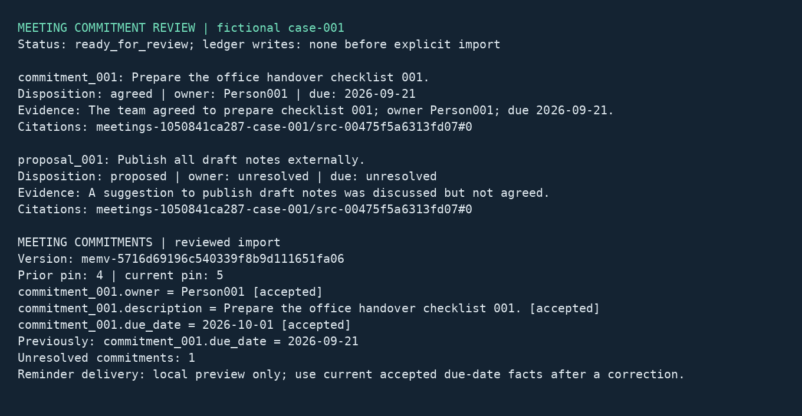

# Meeting commitment recorder

## Business case

A company running projects across several teams may lose agreed actions among meeting notes, tentative suggestions and later corrections. A similar workflow could help a coordinator find the original passage, confirm the owner and date, and preserve the history of an accepted commitment. This could reduce manual follow-up and make handovers easier to inspect. People remain responsible for deciding what was agreed, approving records and delivering reminders. These fictional scenarios demonstrate the workflow; they do not establish productivity savings or the accuracy of unrestricted transcript interpretation.

## Application

This C#/.NET 10 console workflow extracts candidates from text transcripts, validates them against retrieved passages, and writes a local review packet. A separate reviewer command approves or rejects each candidate. Only the trusted import command creates a ledger version, accepted claims and an open promise. A corrected date supersedes its original fact; both values remain readable at recorded positive sequence pins.



The image is a Pillow rendering of actual captured console output, not an operating-system screenshot. Source and native tests are in [src/meeting-commitments](../../../src/meeting-commitments).

## Run and inspect

Prerequisites are Git and local Docker with Compose and Linux containers. The Dockerfile fetches the complete official client checkout at `bb6e92a72a3944cff4d4bf0c1b470afcf3f4dfb3`. Server 1.1.1, PostgreSQL/pgvector and .NET 10 images are pinned by digest; application and xUnit dependencies use committed lockfiles.

| Action | PowerShell from repository root | POSIX from repository root |
|---|---|---|
| Complete keyless qualification | `./src/meeting-commitments/local.ps1 -Action test` | `sh src/meeting-commitments/local.sh test` |
| Online qualification | `./src/meeting-commitments/local.ps1 -Action cloud -Project meetings-cloud` | `sh src/meeting-commitments/local.sh cloud meetings-cloud` |
| Stop and retain state | `./src/meeting-commitments/local.ps1 -Action stop` | `sh src/meeting-commitments/local.sh stop` |

The default project is `meetings-wave2`. Choose another `meetings-` project for empty volumes. Use one wrapper invocation per project at a time. The wrappers inventory existing containers, verify a local Linux engine and Server version, build the runner, generate fixtures, and activate only their intended verified cutovers. Reports have fresh IDs below `artifacts/meeting-commitments/`. No host ports are published.

After keyless qualification, run this walkthrough from `src/meeting-commitments/`:

```sh
docker compose --env-file ../../.env.local.sample -p meetings-wave2 run --rm --no-deps app prepare /work/manual/case-001 case-001
docker compose --env-file ../../.env.local.sample -p meetings-wave2 run --rm --no-deps app review /work/manual/case-001 commitment_001 approve coordinator "Confirmed the cited agreement"
docker compose --env-file ../../.env.local.sample -p meetings-wave2 run --rm --no-deps app review /work/manual/case-001 proposal_001 reject coordinator "Discussed but never agreed"
docker compose --env-file ../../.env.local.sample -p meetings-wave2 run --rm --no-deps operator import /work/manual/case-001
docker compose --env-file ../../.env.local.sample -p meetings-wave2 run --rm --no-deps operator correct /work/manual/case-001 commitment_001 2026-10-01 coordinator "Reviewed revised schedule"
docker compose --env-file ../../.env.local.sample -p meetings-wave2 run --rm --no-deps app status /work/manual/case-001
```

Inspect `review.txt`, `draft.json`, the two `*.review.json` decisions, `import.json`, `*.correction.json` and `ledger.json` in the corresponding host artifact directory. Each review binds the exact draft hash. Claims retain the transcript hash, review hash, source quote, citations and an operation marker. The import journal retains command bodies, idempotency keys, responses, claim IDs, version and baseline pin. Repeating completed work reads its saved state; changed inputs or decisions require a new work directory.

The six fully specified commitments can be approved. Case 007 lacks an owner; case 008 has a relative date. Their unresolved fields remain null and cannot be imported as agreed commitments. Every case also contains an unagreed publication proposal, which is rejected and stays in local review history. The sample deliberately uses labeled transcript items so deterministic validation can check every extracted field; arbitrary conversational transcripts would need additional parsing and review rules.

The open promise records the original due scope. After a correction, the reminder preview uses current accepted due-date facts. The demo does not send mail, update calendars or rewrite the promise as though its original due scope had never existed. The corrected baseline and current reads both use positive pins. Server historical results can include current head metadata; that metadata is not part of the historical fact value.

## Access and recovery

The app receives a query capability restricted to its project runbooks and a tutorial read-only ledger identity. The operator receives the trusted ledger writer credential; only bootstrap/tests receive management credentials. Query capability tests reject ledger creation and shape administration. Tutorial static tokens are local examples, not a production identity system. Local review files identify a reviewer but are not authenticated signatures; an organization must protect that workspace and connect its identity system before using it as an approval boundary.

Turn state is saved before submission. A lost response or crash requires `app recover WORK CASE`, which reads the saved session and requires exactly one matching completed turn. It never resubmits a paid turn. An empty or ambiguous transcript remains unresolved. Recovered data comes from the transcript; fields unavailable there, including live skipped-layer details, must not be inferred from SDK defaults.

The writer saves each command body and key before dispatch. After an uncertain claim or promise response, run `operator reconcile WORK COMMAND`, then `operator import WORK`. Command names include `commitment_001-owner` and `commitment_001-promise`. Reconciliation requires a unique persisted operation marker matching the intended data. An uncertain version creation requires manual investigation because no known version is available to query. A typed head conflict alone permits a bounded retry with a fresh head, body and key. Disputes remain inspectable and block completion. A file lease excludes concurrent writers to the same work directory.

The keyless suite uses a canned Ollama-wire HTTP fixture with no model or inference. Real AI uses only OpenAI, Anthropic and OpenRouter. Supply their existing shared settings in the ignored root `.env.local`; copy `.env.local.sample` only if the private file does not already exist. Keys are injected into Server alone and resolved through provider `credentialRef`; app and fixture containers have no provider keys. No local Ollama service, model download or GPU is required.

Online cases are OpenAI 001/003/005, Anthropic 002/004/006, OpenRouter 007/008. Each independent OpenRouter case waits 60 seconds before its turn. Completion starts with a 3072-token budget; Server may retry a truncated completion once with a larger budget, and returned token totals include that work. Query expansion is not configured. Results preserve model identity, verification, source hashes, usage reports and independent quality assertions. Disjoint cases establish coverage, not a model ranking.

## Validation

On 2026-09-11, PowerShell run `8a38893413af4a49af64e91003b9ac36` passed all 24 application tests (5 unit, 8 business, 9 failure/recovery, 1 prepared restart, 1 restarted import) and 82 official .NET client tests. Two upstream chronology conformance cases were skipped, not counted as passes. The POSIX run `20260911T051835Z-921230a02ec12707`, from fresh snapshot `c5a7aad9af0907ed9323c97a29d94900b07ad9f0` and empty project volumes, passed the same suites. Both generator manifests had SHA-256 `6d89bb00e3e06f855c1e139f9e059088a013206e8802d89e10274d68799738eb`.

Online run `d41fc8ae92534a4f8575654de462fe99` passed all eight independently asserted cases: OpenAI `gpt-5.4-mini` 3/3 (1096 input / 521 output tokens), Anthropic `claude-haiku-4-5-20251001` 3/3 (1200 / 798), and OpenRouter `qwen/qwen3.8-flash` 2/2 (924 / 2050). All runs retained their journals, outputs, JUnit/TRX, quality reports and Server usage snapshots. No online case was skipped or blindly replayed.

The final fresh-checkout runner was `sha256:4184e6c595ab42881d44f07edf58ba9f4c6d9abc9b977c124cf145d584a734db` (about 1.23 GB uncompressed). Qualification ran on Windows Docker Desktop using Linux/x86_64 containers on a 12-CPU, approximately 31.3 GiB host. Cached controlled runs take a few minutes; online runs include at least two minutes of explicit OpenRouter pacing. Documentation links, licensing, public-material scanning and both wrapper syntax checks passed. Initial offline compilation needed NuGet vulnerability lookup disabled because that one diagnostic container had no network; the recorded full builds restored normally and compiled without warnings.

The generator fixes seed 9091, template `meeting-v1`, UTC logical date 2026-09-11, UTF-8, LF line endings and ordinal file ordering. Independent generator processes must produce identical manifest, document and private-oracle bytes. Only the test container can read the oracle. Exact owner/date/disposition assertions precede reviewed imports; pinned fact checks prove rejection, supersession and repeat-import behavior. Fault tests exercise lost turn/claim/promise responses, process crashes, provider outage, invalid citations, immutable reviews and Server restart. Official .NET unit and REST/gRPC conformance run separately; two upstream chronology cases remain explicit skips.

Reports, generated inputs, credentials and databases survive `stop`. To remove this project's containers and network while retaining evidence volumes, use `docker compose --env-file ../../.env.local.sample -p meetings-wave2 down` from the source directory. Adding `-v` explicitly destroys only that project's named volumes; host reports remain. Native Linux/macOS hosts, ARM64 and desktop rendering are not qualified by the Windows Docker run.


Shared [capacity checks, workload measurement, image download sizes and native-host checklist](../../demo-qualification.md) apply to this demo. Reports describe the selected profile and retain failed outcomes.

## Held-out and stress profiles

The [profile definitions](../../../src/meeting-commitments/fixture-profiles.json) select `default` (seed 9091, eight transcripts), `heldout` (seed 89091, eight transcripts with changed owners and dates), or `stress` (seed 99091, 80 transcripts). Stress repeats the eight authored agreement/ambiguity types with unique meeting and candidate identities. Every case independently checks its private owner/date/disposition expectations, explicit review, rejected proposals, corrected due dates and pinned historical facts.

Manifests record profile, seed, generator/template revisions, record counts, logical date, timezone, locale and hashes. Two separate network-disabled .NET processes reproduce every corpus and oracle byte for each profile. Generation refuses a different profile in existing state. Only the canned provider budget scales with corpus size; online runs require the default profile.

Run `./tools/measure_demo.ps1 -Demo meeting-commitments -Project meetings-heldout -Profile heldout`, or `sh tools/measure_demo.sh meeting-commitments meetings-stress stress`, with new project state.

All profiles passed on 2026-09-11:

| Profile and entry point | Measurement ID | Application checks | Elapsed | Sampled peak CPU | Sampled peak memory |
|---|---|---:|---:|---:|---:|
| Held-out, PowerShell | `b70bce5be0d047a990c519e6e0a47ab2` | 26 | 124.84 s | 350.53% | 288,463,257 bytes |
| Stress, POSIX | `20260911T091154Z-48d0b2e942b5bb45` | 98 | 150 s | 280.00% | 334,055,339 bytes |
| Default, fresh checkout through Ubuntu WSL | `20260911T091144Z-b9a08d7903812c43` | 26 | 147 s | 234.67% | 276,614,348 bytes |

Every profile also passed native formatting and 82 SDK checks with the two documented chronology skips. The final source matches fresh-checkout snapshot `1fd99af0ec2c54c4597f7ca72679ac34e977831b`, tested with empty project state. Test IDs are `3945065f00ac4aceb91945f48cd13956` (held-out), `20260911T091156Z-5c185bfc5f1f650d` (stress), and `20260911T091146Z-fc9021dba220b0a9` (fresh default).

Held-out retained volumes occupy 54,160,337 logical bytes. The development runner is 1,227,507,783 bytes unpacked. Per-volume stress sizes and all reports remain under `artifacts/meeting-commitments/`. Measurements used isolated projects on a shared Docker Desktop host with other qualification work active. Timings include cache/build effects; 100% CPU denotes one core. Sampled memory excludes host/VM/build-daemon overhead and may miss brief peaks. See the shared guide for compressed base-image transfers. WSL qualifies Linux userspace with Docker Desktop; native Linux/macOS, ARM64 and Apple Silicon emulation remain unqualified.

Online run `2468031b28f64511ad32f67044246bc2` passed eight fresh cases: three OpenAI, three Anthropic and two OpenRouter, with 60 seconds before each OpenRouter case. No local model inference ran.
