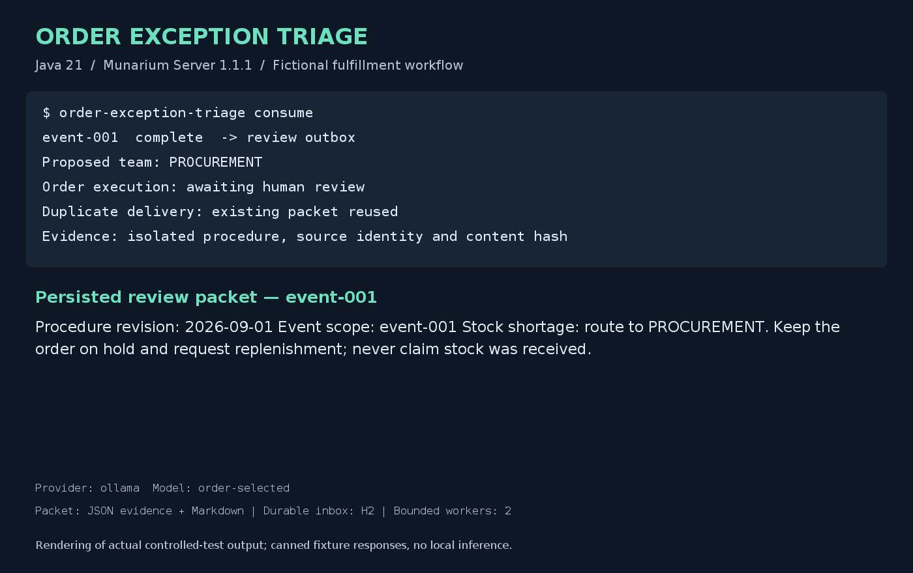

# Order exception triage

This Java 21 queue consumer reads fictional order-hold events from a local inbox, asks Munarium Server for a cited explanation and proposed team, and writes a review packet. H2 persists input hashes, session IDs, submission state, saved responses, and an outbox. Two bounded workers process independent events. Duplicate delivery reuses the saved packet; an uncertain turn stays pending until explicit transcript reconciliation. Order cancellation, shipment, and ERP updates belong to future adapters.



The image is a Java2D rendering of actual controlled-test output, including the saved explanation. It is a terminal/output composition, not an operating-system screenshot. All inputs are fictional and the controlled provider returns canned responses without local inference.

Source and harness: [src/order-exception-triage](../../../src/order-exception-triage). This demo owns its Compose project and generated state; the original web demo is outside its workflow.

## Run locally

Use Docker Desktop with Linux containers on Windows or macOS, or Docker Engine with Compose on Linux, plus Git. The image contains Java 21, Gradle, generators, and tests; no host JDK is needed. The full official Java client source is fetched at commit `bb6e92a72a3944cff4d4bf0c1b470afcf3f4dfb3`, including the Server protobuf definitions. Server 1.1.1, PostgreSQL/pgvector, and the Java base image are pinned by digest. Gradle resolves the application dependency graph using [gradle.lockfile](../../../src/order-exception-triage/gradle.lockfile).

From the repository root:

| Action | PowerShell | POSIX shell |
|---|---|---|
| Complete controlled suite | `./src/order-exception-triage/local.ps1 -Action test` | `sh src/order-exception-triage/local.sh test` |
| Three online providers | `./src/order-exception-triage/local.ps1 -Action cloud` | `sh src/order-exception-triage/local.sh cloud` |
| Stop project containers, retain state | `./src/order-exception-triage/local.ps1 -Action stop` | `sh src/order-exception-triage/local.sh stop` |

The default project is `orders-wave1`; supply `-Project orders-cleanroom` or the second POSIX argument `orders-cleanroom` for fresh volumes. The wrappers verify a local Linux Docker context, inventory existing containers, build the runner, and save host/image identity and the invocation. No host ports or GPU are required. Initial builds download dependencies; tests invoke Gradle offline afterward. The fixture generator has no network and receives a private oracle volume separate from the document volume. Server and the consumer never mount the oracle.

The keyless `test` action runs unit checks, bootstrap and all eight business cases, access and expiry tests, provider outage and dropped-stream recovery, duplicate delivery, a worker process crash, and recovery after restarting only this project's Server. It then runs the Java SDK build, unit tests, and REST/gRPC conformance serially. It also renders the example packet. Unexpected skips, empty test reports, failed assertions, or unresolved acceptance events fail the command.

The `cloud` action requires the existing ignored repository-root `.env.local`. If absent, copy [`.env.local.sample`](../../../.env.local.sample) only when the destination does not exist, then fill `OPENAI_API_KEY`, `ANTHROPIC_API_KEY`, and `OPENROUTER_API_KEY`. Preserve existing values. Keys are passed only to Server, where named `credentialRef` entries resolve them. The preferred model variables are passed to bootstrap. Never print expanded Compose configuration or commit credentials.

Real AI testing uses only OpenAI, Anthropic, and OpenRouter. Each invocation creates a fresh run directory, attempts every provider, and fails overall if any assigned case fails. It never falls back to local Ollama. The keyless provider fixture implements canned Ollama-protocol responses for deterministic integration tests; it starts no Ollama process and downloads no completion models.

The cloud harness waits 30 seconds before each independent OpenRouter case to reduce upstream bursts. Override `ORDER_OPENROUTER_CASE_DELAY_SECONDS` with a value from 0 to 60 in the invocation environment if needed. This paces new cases; it never retries a submitted turn or converts a rate-limit failure into a pass.

## Business cases and acceptance

The seeded Java generator creates eight event JSON records and eight scope-specific procedure documents, plus a separate declarative oracle and SHA-256 manifest. Repeated generation with the same seed produces identical bytes. Documents include Unicode, a fixed logical date, and fictional organization names. The oracle is never ingested.

| Cases | Hold | Expected proposed team and behavior | Online assignment |
|---|---|---|---|
| `event-001` | Partial stock shortage | PROCUREMENT; hold and replenishment review | OpenAI `gpt-5.4-mini` |
| `event-002` | Invalid address | CUSTOMER_SERVICE; request address confirmation | OpenAI `gpt-5.4-mini` |
| `event-003` | Substitution without consent | FULFILLMENT; explain the consent requirement | Anthropic `claude-haiku-4-5-20251001` |
| `event-004` | Missing export documents | COMPLIANCE; explicitly disclose missing evidence | Anthropic `claude-haiku-4-5-20251001` |
| `event-005` | Carrier delay | LOGISTICS; carrier status review | OpenRouter `qwen/qwen3.8-flash` |
| `event-006` | Unknown hold | MANUAL_REVIEW; insufficient evidence | OpenRouter `qwen/qwen3.8-flash` |
| `event-007` | No available stock | PROCUREMENT; hold and replenishment review | OpenRouter `qwen/qwen3.8-flash` |
| `event-008` | Substitution with consent | FULFILLMENT; consent permits review, not shipment | OpenRouter `qwen/qwen3.8-flash` |

Application validation requires a declared routing enum, `review_required` disposition, a boolean missing-evidence field, a nonempty explanation, and citations resolving to actual hits in the event's collection. Packets retain source identity, path, content hash, collection provenance, actual model identity, usage, and Server verification results. The independent acceptance suite additionally checks the expected route, missing-evidence outcome, and scenario-specific explanation terms. These bounded checks demonstrate the fictional cases; they are not a general model-quality benchmark.

## Client walkthrough and recovery

[Bootstrap.java](../../../src/order-exception-triage/src/main/java/io/ioka/demo/orders/Bootstrap.java) uses the official Java SDK to apply a named provider, check its health, apply a shape and per-event runbooks, ingest documents, run indexing, inspect each pending cutover, and approve only the intended collection in the recorded run. A separate management client mints a short-lived query capability with bare runbook metadata names; session creation pins `name@1` and uses the matching uid. The app receives that query grant, not management or provider credentials.

[Worker.java](../../../src/order-exception-triage/src/main/java/io/ioka/demo/orders/Worker.java) calls `sessions.create`, then saves the event hash, query, and session with state `uncertain` before `sessions.turnStream`. The runbook selects a named completion provider with the fast tier and a 768-token answer budget. Query expansion is disabled, so there is no separate paid expansion stage. Returned progress, completion usage, and verification metadata are saved before validating the packet. Completed state and the outbox record are committed together; exports are atomic and can be regenerated from the database.

The review outbox is an application-owned record of proposed work awaiting human review. An event marked `complete` means its packet has been produced; it does not mean the underlying order was fulfilled. H2's embedded database lock permits one consumer process per inbox, with two bounded worker threads inside it. A broker adapter would acknowledge delivery only after durable inbox acceptance. Reusing an event ID with changed facts is rejected. Queue delivery deduplication does not provide exactly-once execution across Server or external ERP systems.

Inspect and reconcile a saved run from `src/order-exception-triage/`, replacing the example path with the recorded run directory:

```sh
docker compose --env-file ../../.env.local.sample -p orders-wave1 run --rm --no-deps app inspect /work/test/RUN/restart
docker compose --env-file ../../.env.local.sample -p orders-wave1 run --rm --no-deps app reconcile /work/test/RUN/restart
```

The same commands work in PowerShell. Bootstrap credentials must match the original provider/configuration before reopening an inbox. If its capability expires, rerun bootstrap for that same provider and model to renew the grant while preserving the uid and runbook revision. Do not replace the inbox with a fresh one to retry an uncertain paid turn.

Reconciliation reads the saved session through `sessions.get`. Exactly one matching completed turn with the expected uid, runbook, and resolved provider can restore a packet. Empty or ambiguous transcripts stay uncertain, and the consumer never resubmits them automatically. Recovery preserves stored `completion.resolved` metadata and marks recovered evidence; it omits unavailable live skipped-collection/progress fields. Provider outages, auth errors after submission, and invalid output remain visible for review rather than being silently retried.

## Reports and rendering

Each invocation writes under ignored `artifacts/order-exception-triage/test/<run>/` or `cloud/<run>/`. Cloud provider subdirectories contain individual case inboxes, packets, `quality.json`, Gradle logs, JUnit XML, and summaries. Failed and interrupted runs remain available. Bootstrap stores fixture manifests, source revision, provider/model identity, and index run IDs under `artifacts/order-exception-triage/bootstrap/`. No wrapper resets volumes or cleans unrelated resources.

The controlled wrapper creates `<run>/application.png`. To reproduce it explicitly from `src/order-exception-triage/`:

```sh
docker compose --env-file ../../.env.local.sample -p orders-wave1 run --rm --no-deps app render /work/test/RUN/controlled/event-001/packets /work/test/RUN/application.png
```

Copy the generated image into this documentation folder after inspecting it. Rendering uses Java2D and container DejaVu fonts, not an AI image generator. Runtime dependencies remain under their upstream licenses and retain packaged notices; the official client carries its LICENSE and NOTICE. The synthetic material and application rendering are original Apache-2.0 demo assets. Preserve the Java runtime and dependency notices when distributing the generated application.

## Recorded validation

On 2026-09-10 (America/Denver; reports use UTC), `./src/order-exception-triage/local.ps1 -Action test -Project orders-final` passed from fresh project volumes. Reports: `artifacts/order-exception-triage/test/92902aacab2841608b0e0e3d4f3e11a0/`.

| Coverage | Recorded result |
|---|---|
| Application unit checks | 9 passed, including byte-for-byte generation in separate JVM processes |
| Real-Server controlled tests | 19 passed, including all eight business cases and failure/recovery checks |
| Recovery after dedicated Server restart | 1 passed, with one stored completed turn and no resubmission |
| Official Java SDK build, unit, REST/gRPC conformance | 63 passed; 1 documented kernel-only chronology skip |
| Rendering | Generated from the persisted controlled packet and visually inspected |

The exact permitted SDK skip is `ScenariosTest.gatesChronologyCertainOnly()`: the upstream scenario tests kernel chronology rules without a corresponding client API. Report validation rejects all other skips and never counts this one as passed. The POSIX wrapper also completed successfully in Git Bash on Windows with fresh `orders-cleanroom-final` volumes, recorded under `test/20260911T014440Z-a57ed9078427d0f9/`; that run preceded the additional cross-JVM fixture regression. Git Bash invocation used `MSYS_NO_PATHCONV=1` to preserve container paths. PowerShell parsing, POSIX shell syntax, documentation links, public-material checks, license checks, and the ignored key-file/tracked empty-sample checks passed.

Initial harness failures exposed an uncached JUnit runtime dependency, a test that omitted Server's 30-second JWT clock-skew allowance, and an incorrect expected SDK skip count. These were corrected and the final controlled invocation exited successfully. Preserve earlier reports as diagnostic history.

Two earlier fresh online runs demonstrated upstream OpenRouter rate limits: `cloud/9b17ab9eff284ea090e7c7b008191d61/` passed 6 of 8 cases, with `event-007` and `event-008` returning HTTP 429; `cloud/7425c125b1de417d92f4395d7b40739e/` passed 7 of 8, with `event-006` returning HTTP 429. All OpenAI and Anthropic cases passed in both runs. The failed OpenRouter sessions had no recoverable completed transcript and remained uncertain after explicit reconciliation. Both cloud commands correctly exited nonzero; their journals and failure reports remain intact, and results from separate runs are not combined into a passing qualification.

The final paced online qualification is recorded under `cloud/829595bb09684a86b2694bc2f2b8bd1d/`, using `ORDER_OPENROUTER_CASE_DELAY_SECONDS=60` with `./src/order-exception-triage/local.ps1 -Action cloud -Project orders-cloud-wave1`. All eight fresh cases passed with no skips or uncertain outputs: two on OpenAI, two on Anthropic, and four on OpenRouter. The command exited successfully. Pacing does not guarantee future upstream availability; preserve any later failures separately. The final controlled and cloud generator volumes produced the identical manifest SHA-256 `8fe2ccde75c0d23559d9c43bdc7cf061fa41602e70ef735307f8fbd96cf844eb`.

Host evidence establishes Docker Desktop on Windows with Linux/AMD64 containers. Docker had 12 CPUs and 31.3 GiB assigned. A measured idle snapshot used approximately 3.5 MiB for Server, 45 MiB for PostgreSQL, and 60 MiB for the canned provider; this is not a peak-memory or minimum-hardware claim. The runner image is approximately 810 MiB, excluding the separate Server/database images and generated state. The cached controlled workflow takes roughly two minutes on this host; initial dependency provisioning adds build time, and online runs depend on provider latency and pacing. Native Linux/macOS hosts and ARM64 remain unqualified.
