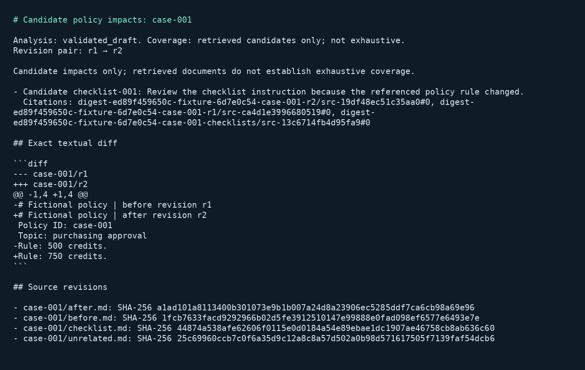

# Policy change impact digest

## Business case

When purchasing, travel or equipment procedures change, process owners must find downstream checklists that may still describe the old rule. A company might build a scheduled digest to bring the exact policy change and supporting checklist passages into an existing review workflow. Plausible benefits include quicker identification of stale instructions and a clearer revision trail; the synthetic workload does not measure savings or productivity. Policy owners decide whether a candidate impact requires action, and existing document-management systems remain responsible for approving and publishing changes.

## Application

This Python job compares explicit before and after policy revisions, retrieves downstream checklist evidence and exports candidate impacts as Markdown, CSV and JSON. Python computes the exact textual diff and checks rule availability. Munarium supplies scoped retrieval and a cited explanation. The report always describes retrieved candidates: top-k search cannot establish that every affected document has been found.



The PNG is a Pillow rendering of actual captured Markdown output. Source, native pytest tests, generator and Docker configuration are in [src/policy-change-digest](../../../src/policy-change-digest).

## Run locally

Use local Docker with Linux containers and Compose. The build uses a digest-pinned Python 3.12 image, locked pip dependencies, the complete official Munarium checkout at `bb6e92a72a3944cff4d4bf0c1b470afcf3f4dfb3`, Server 1.1.1 and pgvector. No host Python environment is required. The image includes a separate system Python/Pillow installation solely to render the output artifact.

| Action | PowerShell from repository root | POSIX from repository root |
|---|---|---|
| Build and full keyless qualification | `./src/policy-change-digest/local.ps1 -Action test` | `sh src/policy-change-digest/local.sh test` |
| Three-provider online qualification | `./src/policy-change-digest/local.ps1 -Action cloud -Project digest-cloud` | `sh src/policy-change-digest/local.sh cloud digest-cloud` |
| Stop while retaining evidence | `./src/policy-change-digest/local.ps1 -Action stop` | `sh src/policy-change-digest/local.sh stop` |

The default project is `digest-wave2`. Use another `digest-` project name for empty volumes, and run one wrapper invocation per project at a time. Reports and journals live under `artifacts/policy-change-digest/`. No host service ports are published. The controlled suite reads the public sample environment file and needs no API key. Its canned Ollama-wire fixture performs no local model inference and cannot mount the private answer key.

After the controlled suite provisions the project, run from `src/policy-change-digest/`:

```sh
docker compose --env-file ../../.env.local.sample -p digest-wave2 run --rm --no-deps app process --case case-001 --work /work/manual/case-001
docker compose --env-file ../../.env.local.sample -p digest-wave2 run --rm --no-deps app process --case case-001 --work /work/manual/case-001
docker compose --env-file ../../.env.local.sample -p digest-wave2 run --rm --no-deps app batch --work /work/scheduled/revision-pair-1
```

The second command restores the completed export without another model turn. `batch` processes all manifest revision pairs once and writes a `batch.json` status summary. An existing scheduler can invoke this command; use the same work directory to reuse completed pairs and a new directory for a new revision pair or configuration. An uncertain item remains for explicit recovery, and a batch with uncertain or unverified items exits with status 2. No email or other publication adapter is enabled.

Inspect `digest.md`, `digest.csv`, `digest.json` and `journal.json` in the chosen work directory. Case 001 changes a purchasing approval rule; case 007 changes only the revision label and produces an unchanged result; case 008 has no after policy and requires an insufficient-evidence result. The tutorial policy format has one explicit `Rule:` field. The full text diff includes revision labels, while substantive-change detection compares that field. This is deliberately narrower than interpreting arbitrary company policy documents.

## Evidence and recovery

[server.py](../../../src/policy-change-digest/digest_demo/server.py) derives namespaces from fixture and configuration hashes. Each case has separate before, after and checklist collections. The comparison runbook can read all three; revision-specific runbooks expose only their selected policy revision. A missing after revision is represented by an availability notice, never a fabricated replacement policy. Bootstrap uploads hash-verified sources, saves build run IDs, checks pending cutovers and approves only the intended collection steps in sequence. Generated digests are written to the work volume and never ingested into authoritative collections.

Bootstrap owns administration credentials and issues a query-only capability bound to the job uid and explicit runbook names. The app receives that capability, and every session pins a concrete runbook version. Provider secrets remain in Server. The tutorial issuer must be replaced by an authenticated token broker for deployed use; an expired capability requires re-provisioning the same identity and scope before recovery.

[workflow.py](../../../src/policy-change-digest/digest_demo/workflow.py) saves the revision hashes, exact diff, configuration identity and query before session creation, then saves the session ID before submitting a turn. It consumes native REST progress events and checkpoints the returned result before exporting. Work-directory leases, flushed temporary files and atomic replacement protect local state. A changed revision pair, model, provider or uid cannot reuse an old journal.

`app recover --case CASE --work WORK` inspects a saved transcript without resubmitting its query. Only one completed matching query under the same uid and runbook can be adopted; model and source validation still run on the recovered result. An empty or ambiguous transcript remains uncertain. A process exit before the receipt checkpoint and a lost accepted stream follow this same path. Recovered exports omit the unavailable live skipped-collection list. Failed session creation remains uncertain because an absent local session receipt does not prove that no session was created.

The output validator requires the supported JSON schema, deterministic availability/change status, the configured completion identity, exact source hashes and citations resolving to retrieved chunks. Each candidate must cite both policy revisions and the affected checklist. Unverified prose remains in the raw evidence sidecar while the human-readable report states that review is required. These checks establish traceability, not factual correctness or a complete impact list.

## Synthetic and online qualification

The generator uses seed 8091, versioned templates and an explicit UTC logical date. It produces eight cases and 32 documents, including Unicode text, an unchanged rule and a missing after revision. Two separate Python processes must produce byte-identical manifests and oracle files. The unit and generator services have no network. Only the acceptance harness receives the private oracle.

Each business case checks independent candidate IDs, status, old/new rules, source identity, provenance and non-exhaustive reporting. The integration suite checks revision-only retrieval without completion, scoped access, expiry, duplicate scheduling, changed revision pairs, irrelevant citations, provider outage, dropped streams, process exit before checkpointing and Server restart. JSON quality files, JUnit XML, SDK reports, source manifests, progress events and raw completions remain in each run bundle. Missing suites, failures and unexpected skips fail qualification.

For online runs, use the ignored root `.env.local`. Preserve an existing file; if absent, copy `.env.local.sample` and supply the three provider keys and preferred models. Use `KEY=value` assignments, quoting values containing spaces, `#` or `$`. Compose passes secrets only to Server and model names to bootstrap; named provider configurations resolve keys through `credentialRef` environment variables.

| Provider | Preferred model | Independent cases |
|---|---|---|
| OpenAI | `gpt-5.4-mini` | 001, 003, 005 |
| Anthropic | `claude-haiku-4-5-20251001` | 002, 004, 006 |
| OpenRouter | `qwen/qwen3.8-flash` | 007, 008 |

OpenRouter waits 60 seconds before each case. Every online invocation uses fresh sessions and work directories. The runbook has no model query expansion and uses an initial 3072-token completion budget; Server can retry a truncated completion once at four times that budget. Cumulative completion usage includes those paid retries. The application adds no automatic paid-turn replay. These disjoint cases demonstrate coverage, not comparative provider performance. Usage reports and actual completion identities are retained, and a provider failure makes the overall qualification fail while other providers are attempted.

## Recorded validation

PowerShell run `b31362b59b1d46bf982d2b7c81bc75a7` passed all 23 application checks: six native unit tests, eight independent business cases, eight integration checks and one Server-restart check. The Python SDK passed 175 tests with four documented kernel-only chronology skips. No other tests were skipped. Ruff lint and formatting checks passed, and the output PNG was rendered from the captured digest.

Earlier build run `0538b2f4cf85497aa48579127ee3e781` stopped because the copied Docker context allowlist omitted the new package and renderer. Run `5b9bf4439b3544b4be991dffac765960` passed its six unit tests but stopped during bootstrap because it expected all three cutovers to await approval simultaneously; Server exposes them sequentially. Both failures remain recorded separately. An initial online attempt stopped before provider calls because Docker's network address pool was exhausted; completed test-project containers and networks were removed while retaining their volumes and reports.

Fresh checkout `16f96e94cd347a971b69ffbc2ea04aacb0f5d89b` passed the full POSIX suite with empty `digest-cleanroom` volumes and no private environment file. Run `20260911T043231Z-68a267030a78fbd5` passed the same 23 application checks and 175 SDK checks, with the four documented skips. It additionally exercises the scheduled batch CLI in the completed-pair replay check. Its fixture manifest is byte-identical to the PowerShell run, and its runner image is `sha256:7b892fdb23736582f4961a99604ed45fa608d57f6237e89b92059698d63eed2d`. Wrapper syntax, documentation links, licenses and public-material checks passed.

Online run `4f89773c7e9c4017b822831e48a2c0fd` passed eight fresh independently asserted cases: three OpenAI, three Anthropic and two paced OpenRouter cases, using the preferred models listed above. No case was skipped, uncertain or recovered from prior work. The earlier network-pool failure was run `54be679559c04eebac92332165d9c77d` and made no provider calls.

Docker Desktop exposed Linux/x86_64, 12 CPUs and about 31.3 GiB memory; these describe the observed test environment, not minimum requirements. Native Linux/macOS hosts and ARM64 remain unqualified. Synthetic fixtures, documentation and rendered output are Apache-2.0 material; dependencies retain their respective licenses.
