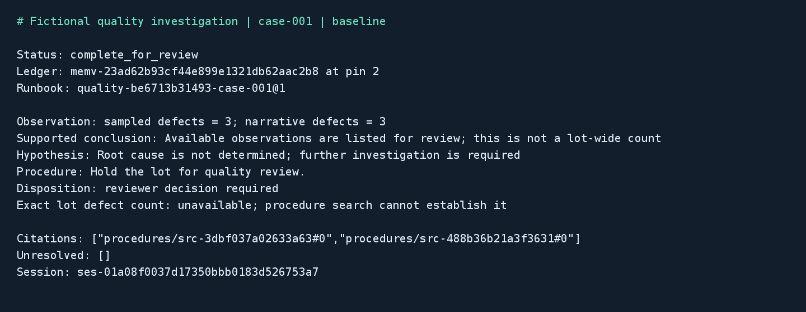

# Quality investigation packet

## Business case

A manufacturer may need to assemble inspection records, shift notes and applicable procedures before investigating a defective lot. Those records can disagree, and a search result can omit evidence that matters to the review. A similar batch application could reduce time spent gathering material and make missing observations and conflicting values easier to see. Inspectors still own their observations, and qualified reviewers determine root cause and disposition. The fictional data demonstrates evidence handling; it does not measure production quality improvements or establish that a process meets a regulatory standard.

## Application

This Java 21 batch job combines a recorded sample inspection with narrative notes and quality procedures. Its runbook research profile declares a controlling `facts:<version_id>` layer and a required document layer. The packet separates observations, supported conclusions, hypotheses and reviewer decisions. Deterministic Java comparisons flag disagreement; the hierarchy does not automatically establish every fact/document conflict.



The image is rendered by Java2D from an actual exported packet. It is a terminal-style rendering, not a desktop screenshot. Source and JUnit tests are in [src/quality-investigation](../../../src/quality-investigation).

## Run and inspect

Install Git and local Docker with Compose and Linux containers. The pinned Java image fetches the complete official source checkout at `bb6e92a72a3944cff4d4bf0c1b470afcf3f4dfb3`; Gradle includes the official Java client as a composite build. The committed Gradle lockfile fixes application dependency versions. Server 1.1.1 and PostgreSQL/pgvector are also pinned by digest.

| Action | PowerShell from repository root | POSIX from repository root |
|---|---|---|
| Complete keyless qualification | `./src/quality-investigation/local.ps1 -Action test` | `sh src/quality-investigation/local.sh test` |
| Online qualification | `./src/quality-investigation/local.ps1 -Action cloud -Project quality-cloud` | `sh src/quality-investigation/local.sh cloud quality-cloud` |
| Stop and retain state | `./src/quality-investigation/local.ps1 -Action stop` | `sh src/quality-investigation/local.sh stop` |

The default project is `quality-wave2`. Use another `quality-` project for empty volumes, and one wrapper invocation per project at a time. The wrappers inventory existing containers, validate a local Linux engine, verify Server version, generate documents, record index runs and approve only their intended verified cutovers. No service publishes a host port. Tests run offline after image provisioning; the generator has no network. Each invocation writes a fresh report directory below `artifacts/quality-investigation/`.

From `src/quality-investigation/`, inspect a baseline and its reviewed correction after the controlled suite:

```sh
docker compose --env-file ../../.env.local.sample -p quality-wave2 run --rm --no-deps app packet /work/manual/baseline case-001 baseline
docker compose --env-file ../../.env.local.sample -p quality-wave2 run --rm --no-deps app packet /work/manual/corrected case-001 corrected
```

The controlled walkthrough already records a correction for each synthetic case. In a newly bootstrapped project, the separate writer action creates a correction:

```sh
docker compose --env-file ../../.env.local.sample -p quality-manual up -d server provider-fixture faults
docker compose --env-file ../../.env.local.sample -p quality-manual run --rm --no-deps generator
docker compose --env-file ../../.env.local.sample -p quality-manual run --rm --no-deps bootstrap
docker compose --env-file ../../.env.local.sample -p quality-manual run --rm --no-deps app packet /work/manual/before case-001 baseline
docker compose --env-file ../../.env.local.sample -p quality-manual run --rm --no-deps writer correct case-001 2 reviewer "Reviewed corrected sampled inspection"
docker compose --env-file ../../.env.local.sample -p quality-manual run --rm --no-deps app packet /work/manual/after case-001 corrected
```

Open `packet.md`, `packet.json` and `journal.json` in the matching host directory. Research-profile document citations use the rendered `procedures/<chunk_id>` label; the packet resolves each label back to its returned collection, source path and hash. JSON retains direct observations with claim IDs, source paths and hashes, layer outcomes, completion identity and verification, the session ID, runbook revision, ledger version and positive pin. The trusted registry in the credential volume retains baseline/child bindings, reviewed correction intent, command bodies, keys and receipts. It contains tutorial query credentials separately in `query.json`; do not publish that credential file.

## Evidence and version boundaries

Each baseline version is populated by a trusted importer from a hash-verified inspection record, then marked frozen by application policy. The application checks the recorded positive head before and after a turn. A correction creates a child version, records the reviewed replacement with supersession, freezes the child and applies runbook revision 2 with that child's explicit fact binding. It never appends a correction to the original investigation version. The original record remains readable at its saved pin and through runbook revision 1.

This is an application freeze, not a Server write lock. A different trusted writer can still modify a version; the packet workflow detects a changed head and refuses it. Session turns do not accept the direct ledger query's historical sequence pin. The research layer reads its runbook-bound version, so preventing writes to that version matters. Fact slices and document hits do not establish complete lot-wide counts. The packet always reports that a complete lot defect count is unavailable.

Eight cases contain sampled inspection counts and narrative observations. Cases 002/004/006 deliberately disagree. Case 007 lacks an inspection defect observation; case 008 lacks a narrative count. Missing values remain null, and those packets are incomplete. A supported numeric observation is not a root-cause finding. All outputs retain reviewer responsibility for disposition; model suggestions do not update business systems.

The app has a runbook-scoped query capability and a tutorial read-only ledger identity. Bootstrap and the correction writer are separate trusted processes. Core ledger reads are not represented as document clearance filtering: deployments must authorize the dedicated version bindings in their trusted configuration. The test oracle is mounted only in tests, never bootstrap, app, Server or the canned provider. The correction registry requires a writable operator mount; the app receives it read-only. Tutorial static tokens and local reviewer strings must be replaced by an organization's identity and approval system.

## Failure and recovery

The journal records a turn intent and session before the paid turn. Completed work is reused only when its exact input/configuration binding matches. An interrupted stream, network error or process crash leaves an uncertain journal; a normal invocation refuses to replay it. Use `app recover WORK CASE baseline|corrected` to inspect the saved session. Recovery requires exactly one matching completion and the expected identity and runbook.

Server 1.1.1 transcripts do not preserve every live hierarchy or skipped-layer field. Recovery retains the completion and available citations, omits unavailable fields, and labels the packet incomplete pending review. It does not invent a successful hierarchy decision. An empty transcript remains uncertain. The coordinator saves failure logs and does not submit a replacement paid turn automatically.

Ledger creation and claims also save intent before dispatch. A known completed receipt can be resumed; an uncertain version/claim outcome blocks further import for operator inspection. There is no blind command replay. Corrections have immutable review intent and use a file lease to serialize registry updates. Disputes retain their native findings and prevent the version from being frozen. Runbook activation records are separately inspectable.

CLI status 0 means a packet is available for review, including an explicit disagreement; status 3 means incomplete evidence or analysis; status 2 means an operational error or unresolved command/turn. A complete-for-review status does not approve the lot. No external publication or disposition adapter is included.

## Online qualification

Only OpenAI, Anthropic and OpenRouter run real completion. Reuse the ignored root `.env.local`; copy the sample only if that private file does not already exist. Keys are passed only to Server and resolved via provider `credentialRef`. The app sees the selected provider/model name, never its key. The keyless fixture speaks the Ollama wire protocol with canned responses and loads no model. There is no Ollama inference service or GPU requirement.

Assignments are OpenAI 001/003/007, Anthropic 002/004/008, OpenRouter 005/006. Each OpenRouter case waits 60 seconds before its independent turn. All eight cloud cases use fresh work and are asserted against the separate oracle; expected incomplete packets count as correct missing-evidence behavior, not as complete investigations. Corrections and additional failure injection are exercised in the controlled profile. The initial completion budget is 3072 tokens; Server can retry truncation once at a larger budget. Returned usage includes those retries. No model query expansion is configured. Provider coverage is not a comparative benchmark.

## Validation

PowerShell run `67cb163027bc40b688dec604ed0ff2d2` passed 22 application tests (5 unit, 8 business scenarios including corrections, 8 failure/recovery checks and 1 restart recovery), plus 63 official Java client tests. One upstream chronology test was skipped and not counted as a pass. Fresh-checkout run `20260911T054235Z-4966e90750c53ead` at snapshot `e7ed8ccaa45e0f102c0a873ee6ed1f4419fb377b` passed the same counts and additionally exercised repeated correction intent after persistence.

Preserved failed runs include `21b3164c32bc45e8927c63140decefb6` (one unit failure from omitted null map entries), `208444e4baea4b438c64cb4058f8b4be` (eight business failures while validating hierarchy labels as collection labels), and `8d9adf035dd445c6ac660c833ddd0ca8` (eight repeat comparisons distinguished Jackson integer/long node types although serialized JSON was identical). The fixes preserve explicit nulls, resolve layer labels to actual sources and compare persisted JSON values. All eight controlled business cases then passed.

The first online run `35a5e9d55c6e4425a181f687c10bb870` passed five of eight cases (OpenAI 1/3, Anthropic 2/3, OpenRouter 2/2) and retained citation-schema failures from OpenAI cases 001/003 and Anthropic case 004. Those packets correctly remained incomplete. The prompt now explicitly requires a two-string document citation array; it does not relax source validation. The final prompt passed all 22 application tests and 63 official Java tests (one documented chronology skip) from snapshot `2ca78253f6f1d1a79d32fa45e55c1cbbfa120b4c`, fresh checkout run `20260911T054429Z-c73547e659b09504`, and empty `quality-finalroom` volumes. All three successful controlled manifests had SHA-256 `14c476b8ed9dff4c1fb6c8aae6c1b5e15d461ca46bd14eb8076c1595d18a83c2`. The controlled runner built with all Java compiler warnings treated as errors; an initial deprecated Jackson iterator call was replaced before qualification.

Final online run `481046eef30244b5929a38ed534da900` passed all eight cases: OpenAI `gpt-5.4-mini` 3/3 (1110 input / 228 output tokens), Anthropic `claude-haiku-4-5-20251001` 3/3 (1208 / 341), and OpenRouter `qwen/qwen3.8-flash` 2/2 (912 / 1928). It used fresh journals and a new isolated project; the earlier failed run was retained. All required cloud cases ran, including the two explicit missing-observation outcomes. Usage snapshots, model outputs, native JUnit and per-case quality files remain under that run ID.

The final cleanroom runner was `sha256:f6e8da85da7fe86e9517ae1c89d849a7f01d0305862018865173a9807c8ca955`, approximately 843 MB uncompressed. Runs used Windows Docker Desktop with Linux/x86_64 containers on a 12-CPU, approximately 31.3 GiB host. A sampled idle measurement showed about 3.4 MiB for Server and 43 MiB for PostgreSQL; those are observations, not sizing guarantees. Cached controlled runs take a few minutes, and the online profile adds at least two minutes of OpenRouter pacing. Initial provisioning downloads the JDK/Gradle/client dependencies; later controlled invocations use the cached runner. Documentation, license, public-material and wrapper syntax checks passed.

The generator fixes seed 10091, template revision 1, the eight-lot profile, ROOT locale and UTC logical time 2026-09-11, with UTF-8 and LF text. Two independent Java processes must emit identical inputs, manifests and oracle bytes. The manifest records 24 files and hashes. Exact assertions cover observed values, missing evidence, disagreements, child corrections, preserved parent pins, required layer outcomes and source citations. Failure tests exercise scoped access, real token expiry, changed frozen heads, unserved citations, provider outage, lost responses, process crash and Server restart. Official Java unit and REST/gRPC conformance run separately, with the upstream chronology skip reported explicitly.

`stop` retains everything. To remove only this project's containers and network while retaining volumes, run `docker compose --env-file ../../.env.local.sample -p quality-wave2 down` from this source folder. Adding `-v` explicitly destroys its named data/input/credential volumes; host reports remain. Native Linux/macOS hosts and ARM64 require their own qualification; Docker Desktop on Windows is not evidence of those host platforms.


Shared [capacity checks, workload measurement, image download sizes and native-host checklist](../../demo-qualification.md) apply to this demo. Reports describe the selected profile and retain failed outcomes.

## Held-out and stress profiles

The [profile definitions](../../../src/quality-investigation/fixture-profiles.json) select `default` (seed 10091, eight lots), `heldout` (seed 90091, eight lots with changed observed/narrative/corrected defect counts), or `stress` (seed 100091, 80 lots, 80 inspection records and 160 documents). Stress repeats the eight authored agreement/disagreement/missing-observation types with unique lot identities. Every lot is independently checked against private expectations, including required evidence order, reviewed child-version corrections and preserved parent facts.

Manifests record profile, seed, generator/template revisions, record counts, logical date, timezone, locale and hashes. Two separate network-disabled Java processes reproduce every corpus and oracle byte for each profile. Generation refuses a different profile in existing state. Only the canned provider budget scales with corpus size; online runs require the default profile.

Run `./tools/measure_demo.ps1 -Demo quality-investigation -Project quality-heldout -Profile heldout`, or `sh tools/measure_demo.sh quality-investigation quality-stress stress`, with new project state.

All profiles passed on 2026-09-11:

| Profile and entry point | Measurement ID | Application checks | Elapsed | Sampled peak CPU | Sampled peak memory |
|---|---|---:|---:|---:|---:|
| Held-out, PowerShell | `4d8a332c07db461da8f9c1ec785bc521` | 24 | 274.64 s | 406.37% | 1,290,230,822 bytes |
| Stress, POSIX | `20260911T092000Z-b9bb1c21ea17dc36` | 96 | 294 s | 424.39% | 1,188,210,669 bytes |
| Default, fresh checkout through Ubuntu WSL | `20260911T091949Z-32ce300844d9cdcf` | 24 | 337 s | 455.03% | 1,131,292,916 bytes |

Every profile also passed compilation with warnings treated as errors and 63 SDK checks with the one documented chronology skip. Final source matches fresh-checkout snapshot `2ffd33043102ad23a4496b790c315fc16b4f5e1b`, tested with empty project state. Test IDs are `75736cadc0794a51901411ff4cd2b3cc` (held-out), `20260911T092002Z-7aa4e8532790f8b2` (stress), and `20260911T091950Z-6fc44a9b17718025` (fresh default). Online run `cd4f2f8cd5e141b1981def5febfbff7d` passed eight fresh cases: three OpenAI, three Anthropic and two OpenRouter, with 60 seconds before each OpenRouter case. No local model inference ran.

Held-out retained volumes occupy 54,020,637 logical bytes; stress occupies 87,479,572 bytes. The development runner is 843,311,071 bytes unpacked. Reports remain under `artifacts/quality-investigation/`. Measurements used isolated projects on a shared Docker Desktop host with other qualification work active. Timings include cache/build effects; 100% CPU denotes one core. Sampled memory excludes host/VM/build-daemon overhead and may miss brief peaks. See the shared guide for compressed base-image transfers. WSL qualifies Linux userspace with Docker Desktop; native Linux/macOS, ARM64 and Apple Silicon emulation remain unqualified.
