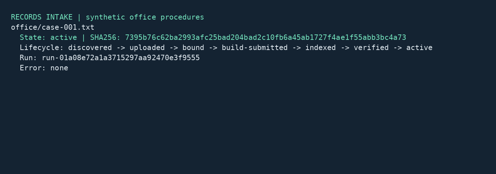

# Records intake service

## Business case

A company receiving procedures and office records in shared folders needs to make approved revisions searchable without exposing incomplete uploads or unfinished indexes. Manual copying and ad hoc rebuilds can leave staff searching obsolete material, while an automatic cutover can publish an unintended revision. A similar background service could track each arrival and replacement, resume interrupted work, and give an operator a clear approval checkpoint. The expected business value is more dependable document availability and a traceable publishing process. Department owners retain responsibility for document content and activation decisions; this synthetic demo does not measure cost savings or compliance outcomes.

## Application

This C#/.NET 10 `BackgroundService` periodically reconciles a repository-relative folder mounted into Docker. It waits for stable bytes, records SHA-256 hashes, uploads with an ingest-only capability, and binds each approved logical filename to its trusted collection. Separate operator commands build, verify, inspect and activate indexes. It makes no AI calls and configures no model query expansion.



The image is rendered from actual captured worker status using Pillow and container fonts. It is a terminal rendering, not an operating-system screenshot. Source, synthetic generators and native tests are in [src/records-intake](../../../src/records-intake). The original web demo is outside this application's workflow.

## Run and inspect

Prerequisites are Git and local Docker with Compose and Linux containers. The runner contains .NET 10 and the complete official client checkout pinned at `bb6e92a72a3944cff4d4bf0c1b470afcf3f4dfb3`. Server 1.1.1, PostgreSQL/pgvector and the SDK base image are pinned by digest. Application and test NuGet graphs use committed lockfiles. Tests execute without package restoration after provisioning.

| Action | PowerShell from repository root | POSIX from repository root |
|---|---|---|
| Complete keyless qualification | `./src/records-intake/local.ps1 -Action test` | `sh src/records-intake/local.sh test` |
| Stop, retaining volumes and reports | `./src/records-intake/local.ps1 -Action stop` | `sh src/records-intake/local.sh stop` |
| Report AI profile applicability | `./src/records-intake/local.ps1 -Action cloud` | `sh src/records-intake/local.sh cloud` |

The default project is `records-wave2`; supply `-Project records-cleanroom` or the second POSIX argument for isolated fresh volumes. Each test invocation uses new collection names derived from its run ID and configuration hashes, retaining earlier indexes and reports. The `cloud` action reports that AI qualification is not applicable, rather than claiming a model test passed. Neither profile reads `.env.local`. This application needs no online provider, local model, GPU or published host port. Other demos retain the OpenAI/Anthropic/OpenRouter restriction and preferred 3/3/2 balance.

After qualification, run these commands from `src/records-intake/` in either shell:

```sh
docker compose --env-file ../../.env.local.sample -p records-wave2 run --rm --no-deps app stage
docker compose --env-file ../../.env.local.sample -p records-wave2 run --rm --no-deps app worker /work/incoming /work/state
```

The worker polls once per second. Its incoming files are visible on the host under `artifacts/records-intake/incoming/`; edit or replace them there. A file must retain the same hash across observations at least two seconds apart. File-system notifications are not required. Unmapped filenames are quarantined, and symbolic links are excluded. Staging preserves existing host files.

In another terminal, inspect and build a registered record:

```sh
docker compose --env-file ../../.env.local.sample -p records-wave2 run --rm --no-deps operator status /work/incoming /work/state
docker compose --env-file ../../.env.local.sample -p records-wave2 run --rm --no-deps operator build /work/incoming /work/state office/case-001.txt
docker compose --env-file ../../.env.local.sample -p records-wave2 run --rm --no-deps operator status /work/incoming /work/state
```

Inspect the recorded run and its verified revision, then replace `RUN-ID` below with that exact run ID:

```sh
docker compose --env-file ../../.env.local.sample -p records-wave2 run --rm --no-deps operator approve /work/incoming /work/state office/case-001.txt RUN-ID
```

An unrelated run or a file changed since verification is rejected. The worker holds the local journal lease during a scan; if an operator finds it busy, issue the operator command after that scan finishes. The tutorial grants cover eight registered filenames in office, facilities, training and purchasing. An organization would provision its own trusted routing catalogue and authenticated credential issuer.

## Client calls and recovery

[Bootstrap.cs](../../../src/records-intake/Records/Bootstrap.cs) uses `Runbooks.ApplyShapeAsync`, `ApplyRunbookAsync` and `Tokens.MintAsync`. The worker receives only an ingest capability. A separate reader capability supports retrieval assertions; the operator service receives the trusted runbook administration token. The application, Server and fault proxy cannot mount the private oracle.

[Intake.cs](../../../src/records-intake/Records/Intake.cs) saves distinct discovered, uploaded, bound, indexed, verified and active states. The first `Ingest.IngestAsync` call supplies an empty explicit collection list; the second supplies the intended collection and checks `BoundTo`. Upload and binding alone leave the active index unchanged. Each revision retains its source identity and hash, with previous local revisions saved in a history directory.

`Runbooks.RunRunbookAsync` is a separate operator action. A unique build runbook and an uncertain submission record are saved before dispatch. The response's run ID is checkpointed before `GetRunAsync` inspects the completed build/verify steps and pending cutover. `ApproveStepAsync` is allowed only for the exact recorded runbook, revision and collection. The existing index remains available until activation.

After restarting the worker or Server, `resume INCOMING STATE FILE` reads the saved run ID. If the start response was lost, the command accepts an explicit fourth argument containing a run ID independently inspected by the operator. Adoption verifies that the ID belongs to the unique saved build runbook. Missing or ambiguous outcomes are never automatically resubmitted. A build-service failure remains visible in the journal; the test proxy demonstrates both a rejected build request and a response lost after Server accepted a build. These are dependency-failure tests, not simulated model outages.

The journal uses exclusive access, flushed temporary files and atomic replacement. An unchanged file is a local replay, while changed bytes reset the stability interval and require another build. A separate operator approval remains necessary for the new revision. A management action taken outside this application is outside its journal's coordination boundary.

## Synthetic acceptance and reports

The generator's fixed seed 5091, versioned templates, UTC logical date and invariant formatting produce eight fictional Unicode office procedures. The manifest records metadata and every input hash; a private oracle independently specifies the expected record references. Two independent native generator processes must produce identical manifests and oracle files. The generator and unit service have networking disabled.

Every business case asserts the complete lifecycle, no retrieval before activation, the exact source reference and content hash, a null completion, and an unchanged-file replay. Other native tests exercise partial writes, unknown routes, typed access denial, per-file batch errors, real capability expiry, replacement revisions, failed builds, lost-response adoption, unrelated and stale approvals, a killed worker process, and recovery after a dedicated Server restart. Integration files live in the repository-relative artifact bind mount, so polling operates on the same host-mounted folder arrangement as the worker.

Reports are under ignored `artifacts/records-intake/test/<run>/`: native TRX, translated JUnit XML, corpus quality records, journals, run snapshots, host/image/source identities and logs. Earlier failures remain preserved. The wrappers stop on failed checks, absent reports or unexpected skips. The official .NET SDK unit and REST/gRPC conformance suites run serially; only their two documented chronology skips are permitted.

The wrapper renders `<run>/application.png`. To reproduce the rendering of an existing captured record from this source folder, replace `RUN`:

```sh
docker compose --env-file ../../.env.local.sample -p records-wave2 run --rm --no-deps --entrypoint python3 app /app/render.py /work/test/RUN/controlled/case-001/status.txt /work/test/RUN/application.png
```

## Recorded validation

The PowerShell run `68efd49edac845638989c754ec2da803` passed on Docker Desktop for Windows with Linux/AMD64 containers: 19 application tests (one generator test, eight independent lifecycle cases, eight failure/recovery cases and two restart phases), 66 official .NET SDK unit tests and 16 REST/gRPC conformance cases. The two upstream chronology cases were skipped because they exercise a kernel-only rule with no public API. Application and SDK builds reported zero warnings; application and test formatting checks passed. The Docker engine exposed 12 CPUs and about 31.3 GiB of memory; this is the test environment, not a minimum resource requirement.

Earlier reports are retained: `87c20d894232416189712f23f1998d88` failed the formatting check, and `58f1d3ce97cb4df9ad98629e6ffd0bdf` failed the eight lifecycle cases because test execution changed the working directory used to locate a runbook template. Asset lookup is now independent of that directory. These failures are not counted as successful qualification.

The final source passed the same 19 application and 82 SDK checks through Git Bash's POSIX entry point from fresh checkout `fa8442af0e886e67f7aab0f767c7783c0181ced8`, with empty `records-cleanroom` volumes and no `.env.local`. Run `20260911T031258Z-ad387d8218061521` retains the reports; its fixture manifest matches the PowerShell run byte for byte. The final runner image is `sha256:0727dd9b5e77d7eb3327e0f17c2aacc050d904e42c01d0e3fa69da98be80bec0`. Documentation links, license inventory and public-material scanning passed. No model qualification is applicable because no completion or model expansion is configured.

Run one invocation per Compose project at a time because its credential volume is shared. Native Linux/macOS hosts and ARM64 remain pending; a Windows-hosted Linux-container pass does not qualify those platforms. Runtime and package licenses remain with the pinned dependencies. The original generator material, documentation and rendering are Apache-2.0 demo assets.
