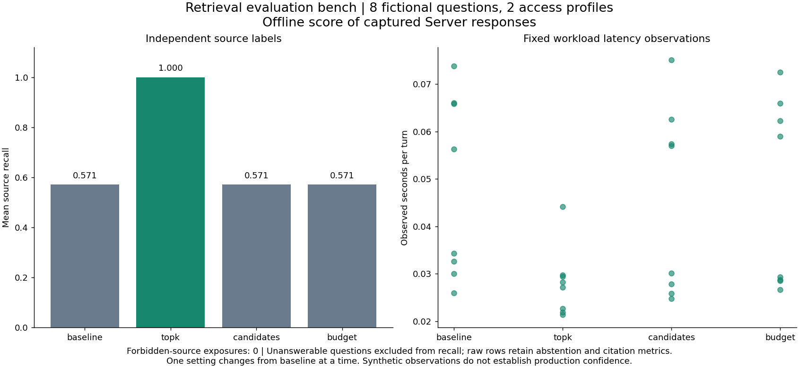

# Retrieval evaluation bench

## Business case

Teams deploying internal knowledge tools need to know whether retrieval finds the right sources before spending time tuning answer wording. A company might build a similar evaluation CLI to compare settings on a fixed, labeled workload and catch access regressions before release. Plausible benefits include more repeatable configuration decisions and earlier discovery of weak evidence; these synthetic measurements do not establish production accuracy, savings or productivity. Domain owners maintain representative questions and relevance labels, security teams define access policy, and people decide whether measured changes justify deployment.

## Application

This Python CLI collects real Server responses and scores them offline against an independent source-label file. It exports Markdown, CSV, raw JSON and static Matplotlib plots. The baseline and three candidates vary one setting at a time. Completion experiments retain individual repeats, so variable model output can be inspected without requiring identical prose.



The figure plots actual recorded measurements, not an operating-system screenshot. Source, generator, pytest tests and isolated Docker workflow are in [src/retrieval-evaluation](../../../src/retrieval-evaluation). The wrapper also retains an SVG plot for export.

## Run locally

Use local Docker with Linux containers and Compose. The image contains Python 3.12, locked pip dependencies and the complete official Munarium client checkout at `bb6e92a72a3944cff4d4bf0c1b470afcf3f4dfb3`. Server 1.1.1, pgvector and the Python image are digest-pinned. A separate system Python installation runs Matplotlib and Pillow for artifact rendering. No host Python environment or notebook is required.

| Action | PowerShell from repository root | POSIX from repository root |
|---|---|---|
| Build and complete controlled suite | `./src/retrieval-evaluation/local.ps1 -Action test` | `sh src/retrieval-evaluation/local.sh test` |
| Repeated online qualification | `./src/retrieval-evaluation/local.ps1 -Action cloud -Project bench-cloud` | `sh src/retrieval-evaluation/local.sh cloud bench-cloud` |
| Stop, retaining reports and volumes | `./src/retrieval-evaluation/local.ps1 -Action stop` | `sh src/retrieval-evaluation/local.sh stop` |

The default project is `bench-wave2`. Use a different `bench-` project name for empty volumes and one wrapper invocation per project at a time. Reports live under `artifacts/retrieval-evaluation/`. No host service ports are published. The controlled suite requires no private environment file or provider key. Its canned Ollama-wire fixtures do not load or run a local completion model.

After the controlled suite provisions the project, run these commands from `src/retrieval-evaluation/`:

```sh
docker compose --env-file ../../.env.local.sample -p bench-wave2 run --rm --no-deps app run --case case-001 --setting baseline --work /work/manual/baseline
docker compose --env-file ../../.env.local.sample -p bench-wave2 run --rm --no-deps app run --case case-001 --setting topk --work /work/manual/topk
docker compose --env-file ../../.env.local.sample -p bench-wave2 run --rm --no-deps app run --case case-001 --setting topk --complete --work /work/manual/completion-1
docker compose --env-file ../../.env.local.sample -p bench-wave2 run --rm --no-deps app run --case case-001 --setting topk --complete --work /work/manual/completion-2
docker compose --env-file ../../.env.local.sample -p bench-wave2 run --rm --no-deps scorer score --work /work/manual
```

Inspect `record.json` for retrieved chunks and model provenance, then compare the source labels in `metrics.json` and the readable `metrics.md`. Use `privileged-app` for a question assigned to that identity, such as case 008. Its credential volume is separate from the public app's volume. Repeating a completed experiment in the same directory restores the saved record without another turn; use distinct directories for intentional repeats. A changed question, setting, mode, identity or model cannot reuse an old journal.

## What the bench measures

| Configuration | Top-k | Candidate count | Context character budget | Change from baseline |
|---|---:|---:|---:|---|
| `baseline` | 1 | 20 | 12000 | Reference |
| `topk` | 4 | 20 | 12000 | Top-k only |
| `candidates` | 1 | 50 | 12000 | Candidate count only |
| `budget` | 1 | 20 | 4000 | Completion context budget only |

Each configuration is a named, pinned runbook using the same versioned shape and evidence collections. The controlled workload performs retrieval and completion for all four settings, with a second completion replicate for `topk`: 72 experiment records across eight questions. Six questions need both submission and approval sources, one question is unanswerable, and one requires the privileged retention procedure. Candidate-count and budget changes need not improve this small corpus; the report records observed outcomes rather than promising an improvement.

Source recall is the fraction of independently labeled relevant source documents found in the returned hits. A question with no labeled answer has null recall and is evaluated for abstention instead. Citation resolution measures whether cited labels identify retrieved chunks; citation relevance additionally checks whether those sources answer the labeled question. A fluent answer citing an unrelated but retrieved source can therefore resolve perfectly and still have zero relevance. The controlled diagnostic demonstrates that distinction.

Per-experiment rows retain schema validity, required answer terms, abstention correctness, remaining verification violations, access leakage, observed latency and cumulative completion tokens. Missing measurements remain null. A recovered turn has no fabricated latency. Token counts are not monetary cost. Reports retain repeat counts and raw outcomes; two synthetic replicates are not enough to estimate production confidence or rank models. Any forbidden-source exposure fails the offline scorer and the acceptance suite.

The runbooks configure no query expansion. Named model overrides are restricted to the configured provider and tested explicitly; normal benchmark turns omit overrides. On Server 1.1.1 an override can affect both expansion and completion when expansion is configured, so such an experiment must be reported as a combined change. To isolate completion behavior, hold expansion settings fixed and omit the override, as the ordinary workload does here.

## Trust and durable collection

[server.py](../../../src/retrieval-evaluation/bench_demo/server.py) verifies the generated source manifest, applies the shape and runbooks, ingests sources with declared hashes, and separately verifies and approves its two collection cutovers. Bootstrap owns administrative credentials and issues uid-bound query capabilities at access levels 0 and 1. The public app, privileged app, offline scorer and bootstrap use distinct mounts. The scorer has no network or credentials, and neither app receives the label file. Only the test harness can join both identities to private labels for qualification.

[workflow.py](../../../src/retrieval-evaluation/bench_demo/workflow.py) saves experiment identity before session creation and the session ID before turn dispatch. It captures native REST progress and flushes the response before exporting. Operating-system leases and atomic replacement protect local work directories. A network error or process exit leaves an uncertain experiment rather than authorizing a duplicate turn.

`recover` uses the same arguments and work directory as `run`, inspects the saved session, and accepts only one matching completed turn under the expected uid and runbook. An empty transcript remains uncertain. Recovered responses omit the unavailable live skipped-collection list. Access denial, disallowed overrides, provider outage, lost accepted streams, process exit before checkpointing, changed experiments and Server restart have explicit tests. Static tutorial administration credentials and the local capability issuer require replacement with organization-managed identities for deployment.

## Online qualification

Use the existing ignored root `.env.local`, preserving its values. If absent, copy `.env.local.sample` and supply the three online keys and model names. Use `KEY=value` dotenv assignments and quote values containing spaces, `#` or `$`. Keys are passed only to Server; bootstrap receives model names and references Server's secret environment through named provider configurations.

| Provider | Preferred model | Cases | Fresh completions |
|---|---|---|---:|
| OpenAI | `gpt-5.4-mini` | 001, 003, 005 | 6 |
| Anthropic | `claude-haiku-4-5-20251001` | 002, 004, 006 | 6 |
| OpenRouter | `qwen/qwen3.8-flash` | 007, 008 | 4 |

Each case runs twice in fresh sessions. OpenRouter waits 60 seconds before each replicate. The runbook uses an initial completion budget of 3072 tokens; Server can retry a truncated completion once at four times that budget, and cumulative token usage includes those paid retries. The application adds no automatic paid-turn replay. Provider usage reports and raw completion identities are retained. Disjoint provider assignments establish coverage and repeated observations, not a comparative model benchmark. The wrapper attempts other providers after a failure and returns a failing overall status if any required provider or case fails.

## Recorded validation

PowerShell run `72b802ae3cc841129af3cf887bc2f5da` passed all 23 application checks: six unit tests, eight fixed-workload cases covering 72 experiments, eight report/access/recovery diagnostics and one Server-restart check. All 175 Python SDK tests passed, with four documented kernel-only chronology skips. No unexpected skips occurred. The measured mean source recall was 0.5714285714 for baseline and 1.0 for top-k 4, across seven answerable questions; the unanswerable question was excluded from recall and scored for abstention. No forbidden source was exposed.

Earlier run `d615b3d8619f4dfc88d3c46e8e6ab757` passed six unit tests and 15 integration cases but failed its permitted-model-override test because the runbook had not explicitly enabled that provider. The runbook now declares the narrow allowlist, and the denied-provider test still rejects other overrides before a provider call. The failed run is retained separately.

Fresh checkout `516b226814db8480b4a69f1bc7d771ee269ab55e` passed the full POSIX suite with empty `bench-cleanroom` volumes and no private environment file. Run `20260911T045211Z-fd35080a93e165cb` passed the same 23 application checks and 175 SDK checks, with four documented skips, and reproduced identical fixture hashes and source-recall measurements. Its runner image is `sha256:3dce6a9f33b466c4e34b33e71405c77a9ca456a6419ce074c02a368a18475936`. The final source-hash assertions, offline scorer and PNG/SVG export passed. Wrapper syntax, documentation links, license inventory and public-material checks also passed.

Online run `8ae6bd370b1841dda9923b57f081f19a` passed all eight case checks and all 16 fresh completion replicates: six OpenAI, six Anthropic and four paced OpenRouter completions. Every applicable replicate passed source recall, source hashes, citation resolution and relevance, answer-term and abstention checks. No forbidden-source exposure, unexpected model identity, skipped case or unresolved turn occurred. Individual responses and timings remain in the provider experiment directories.

Recorded completion usage was 2272 input / 540 output tokens for OpenAI, 2514 / 738 for Anthropic and 1878 / 1663 for OpenRouter. These are measured totals for different assigned questions, not prices or a comparative efficiency ranking.

Docker Desktop exposed Linux/x86_64, 12 CPUs and about 31.3 GiB memory; these are observed resources, not minimum requirements. Native Linux/macOS hosts and ARM64 remain unqualified. Synthetic fixtures, documentation and plots are Apache-2.0 material; dependencies retain their own licenses.


Shared [capacity checks, workload measurement, image download sizes and native-host checklist](../../demo-qualification.md) apply to this demo. Reports describe the selected profile and retain failed outcomes.
