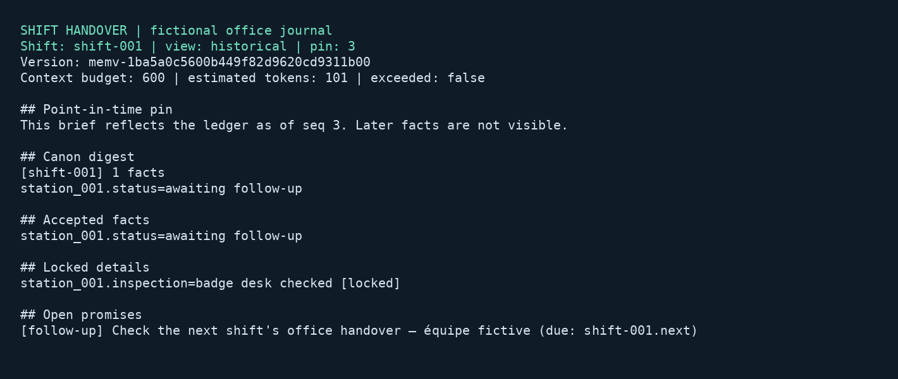

# Shift handover journal

## Business case

Office operations teams hand unresolved work and inspection milestones to colleagues across shifts. Notes scattered across messages make it difficult to distinguish what was known at handover from what was resolved later. A company might build a similar journal to retain reviewed observations, track commitments and reconstruct the exact evidence available at a shift boundary. Plausible benefits include clearer accountability and less repeated investigation; synthetic tests do not establish productivity or safety outcomes. Supervisors approve observations, people perform the work, and existing operational systems remain responsible for equipment control and scheduling.

## Application

This Rust daemon reads newline-delimited events and records reviewed facts, anchors and promises through the official Munarium client. The CLI closes a shift at a positive ledger sequence and produces a token-budgeted brief using `compose_context`. Facts, anchors, promises and composition all use the same version and sequence. Later updates and fulfilled promises appear in the current view while the earlier pinned view remains reproducible.



The image renders actual captured CLI output with Pillow; it is not an operating-system screenshot. Source, native tests, fixture generator and Docker configuration are in [src/shift-handover](../../../src/shift-handover).

## Run locally

Use a local Docker context with Linux containers and Compose. The build downloads the digest-pinned Rust 1.98 image, Server 1.1.1, pgvector and complete official Munarium source revision `bb6e92a72a3944cff4d4bf0c1b470afcf3f4dfb3`. Cargo dependencies are locked; qualification runs offline after the build. No host Rust toolchain is needed.

| Action | PowerShell from repository root | POSIX from repository root |
|---|---|---|
| Build and complete keyless suite | `./src/shift-handover/local.ps1 -Action test` | `sh src/shift-handover/local.sh test` |
| Stop, retaining volumes and reports | `./src/shift-handover/local.ps1 -Action stop` | `sh src/shift-handover/local.sh stop` |

The default isolated project is `shift-wave2`. Choose another `shift-` project name for empty volumes, and run one wrapper invocation per project at a time. Reports and journals live under `artifacts/shift-handover/`. No host ports are published. This application performs direct ledger composition, with no model inference, query expansion, document index or narrative-generation runbook. Its `cloud` action reports that real AI qualification is not applicable. No keys or local completion service are needed.

After qualification provisions the project, run these commands from `src/shift-handover/`. Bootstrap creates new empty versions for the manual exercise; use a fresh manual directory and do not repeat bootstrap while a daemon is active:

```sh
docker compose --env-file ../../.env.local.sample -p shift-wave2 run --rm --no-deps bootstrap
docker compose --env-file ../../.env.local.sample -p shift-wave2 run --rm --no-deps app stage shift-001
docker compose --env-file ../../.env.local.sample -p shift-wave2 up -d daemon
docker compose --env-file ../../.env.local.sample -p shift-wave2 run --rm --no-deps app brief /work/manual/shift-001/state shift-001 current
docker compose --env-file ../../.env.local.sample -p shift-wave2 run --rm --no-deps operator close /work/manual/shift-001/state shift-001
docker compose --env-file ../../.env.local.sample -p shift-wave2 run --rm --no-deps app brief /work/manual/shift-001/state shift-001 historical 64
```

Wait for the daemon to checkpoint the three staged events before closing the shift. Inspect `artifacts/shift-handover/manual/shift-001/state/journal.json`; complete entries contain command receipts. To deliver later arrivals without rewriting the existing file, run:

```sh
docker compose --env-file ../../.env.local.sample -p shift-wave2 run --rm --no-deps --entrypoint sh app -c 'cat /inputs/shift-001-later.ndjson >> /work/manual/shift-001/arrivals.ndjson'
```

Read the current and historical briefs again after the two new receipts arrive. The earlier promise remains open in the historical view. Use the same budget to compare composed content; changing the budget deliberately changes the excerpt. JSON sidecars retain full facts, anchors, promises, context hash and the pin even when the composed text omits material. Server 1.1.1 preserves locked details and open promises, so the minimum composition can exceed a tiny requested budget. The CLI and JSON explicitly report `budget_exceeded`; this token estimate is not a hard model-context limit.

## Trust and recovery

[journal.rs](../../../src/shift-handover/src/journal.rs) owns the durable command loop. The daemon has a trusted write credential; the brief CLI receives only a read credential. Bootstrap owns shape and version administration. These static tutorial credentials require replacement with organization-managed identities in a deployment. A reviewer label is attribution in synthetic input, not proof of enterprise authentication.

Events have stable IDs, a known shift and station, a supported kind, bounded text and explicit review attribution. Unreviewed events stay in local review history. Approval requires a new reviewed event ID; editing an existing ID is rejected. The scanner validates all complete lines before submitting any writes. An incomplete final line, including a split UTF-8 character, waits for its terminating newline. Identical duplicate events reuse the journal. Inputs are limited to one MiB for this tutorial.

Each command body, expected head where applicable, evidence marker and idempotency key is flushed to the journal before dispatch. A confirmed response is checkpointed atomically. Claim updates explicitly supersede the current matching accepted claim. A typed head conflict allows a fresh read and rebuilt attempt with a new key; other errors leave an uncertain entry and prevent blind replay. An exclusive operating-system lease prevents simultaneous writers using the same state directory.

For an uncertain claim, `operator reconcile STATE EVENT-ID` searches for a unique recorded claim with its saved command evidence and body, then retains its receipt and findings. An absent or ambiguous match stays uncertain. Uncertain anchor, promise, fulfillment or initial version-creation commands require operator investigation because matching their visible text alone cannot prove command identity. Re-running bootstrap provisions new isolated versions; it does not reconcile a lost version-creation response. Failed fulfillment is retained for review. Governance acceptance does not prove that a reviewed observation is factually true.

Closing a shift refuses uncertain work and saves its version, positive sequence and journal hash. Repeating close preserves that pin. The current view also reads the head once before issuing its four queries, so concurrent arrivals cannot mix different sequences within one brief. Server includes the latest `head_seq` as metadata in historical fact responses; the exported metadata may advance while the pinned facts and composition remain identical. Generated commentary is absent from the accepted ledger.

## Qualification

The deterministic generator uses seed 7091, explicit UTC logical time, versioned templates and eight fictional office stations. It writes 16 arrival files, a hash manifest and a separately mounted private oracle. Two independent processes must produce identical bytes. The generator and native unit service have no network. The daemon, application, Server and fault proxy cannot mount the oracle.

Eight business cases independently assert prior and current status, open and fulfilled promises, retained anchors, consistent positive pins, composition bounds and duplicate replay. Integration checks cover unreviewed and partial arrivals, changed IDs, read-only and invalid credentials, a lost accepted claim response, dependency outage, daemon termination and restart, process exit before receipt checkpointing, smaller context budgets and Server restart. JSON quality records, JUnit XML, native test logs, command journals and rendered output remain in each run bundle. Missing, failed or unexpected skipped native tests fail the coordinator.

## Recorded validation

PowerShell run `279b5511918d4151b7d6beea5658c06c` passed 20 application checks: three native unit tests, eight business scenarios, eight failure/lifecycle checks and one Server-restart check. All 79 Rust SDK checks passed: 40 unit/doc tests and 39 REST/gRPC conformance and platform checks. There were no skips. Kernel chronology scenarios are not implemented by this Rust conformance suite; that coverage gap is explicitly reported rather than counted as a passing test.

Earlier run `557c7bfb300a4b5cafdbc48fa47a67f8` passed the three unit tests and seven integrations but failed nine controlled assertions: eight compared current-head metadata as though it were historical evidence, and one assumed the composer had a hard token limit. The corrected application exposes budget overflow and the tests compare pinned evidence independently of current-head metadata. The failed run is retained separately.

Fresh checkout `df5cbe44ef0cb7499aee894c5c829668dfc91b60` passed the full suite through Git Bash's POSIX wrapper with empty `shift-cleanroom` volumes and no private environment file. Run `20260911T041317Z-937c0b3c51840429` passed all 20 application and 79 SDK checks, including the final guard against reusing a journal after the bootstrap catalogue changes its ledger version. Its fixture manifest matches the PowerShell run byte for byte. The runner image is `sha256:c7a8e2cee0c87155db54806c7a8c882d2044cd958e08d5e4bea05444b3f178fd`. Wrapper syntax, documentation links, license inventory and public-material checks passed.

Docker Desktop exposed Linux/x86_64, 12 CPUs and about 31.3 GiB memory; these are observed host resources, not minimum requirements. Native Linux/macOS hosts and ARM64 remain unqualified. Runtime dependencies retain their own licenses; synthetic fixtures, walkthrough and rendered output are Apache-2.0 demo material.
